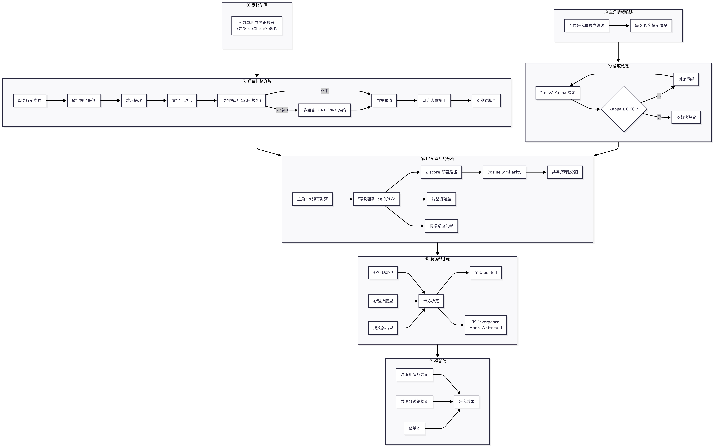
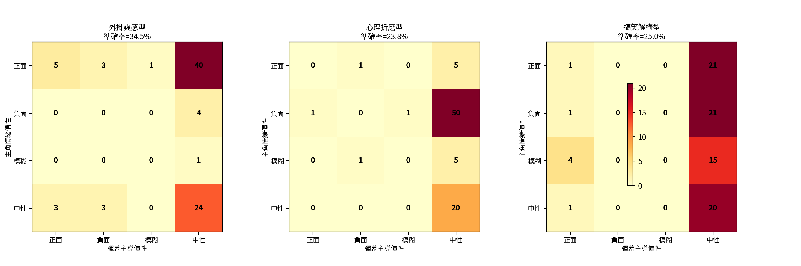
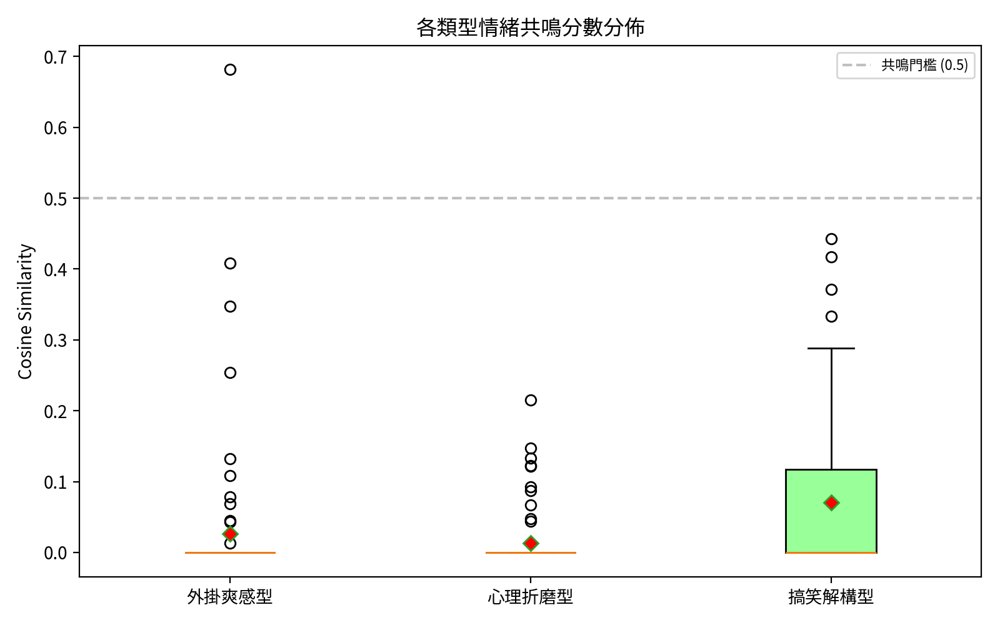
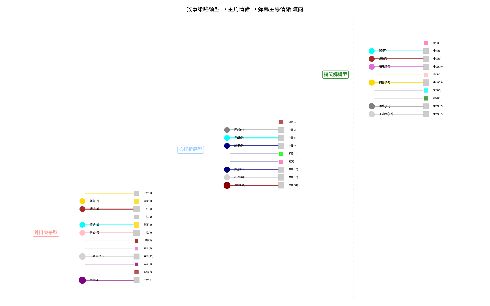

# **從外掛爽番到心理折磨：以主角情緒編碼與彈幕情緒分類探討「異世界」動畫敘事策略對觀眾共鳴之影響**

組員：資工四B1143015林宣佑、資工四B1143021林成瑋、資工四B1143009吳秉融、資工碩二R1343012鄭煒霖

# **一、摘要**

本企劃旨在探討日本動畫「異世界」題材中，不同敘事策略下主角情緒與觀眾即時彈幕情緒之間的一致性與差異性。2010年代前期，多數異世界作品主打主角擁有外掛能力、後宮與無雙爽感；自2016年《Re:從零開始的異世界生活》（Re:Zero）將其轉向心理折磨與高壓敘事後，成功帶動了異世界題材的爆炸性主流化。本研究擷取代表性異世界動畫片段，對影片進行主角情緒手動編碼，同時以多語言 BERT 模型經 ONNX Runtime 就地推論，對動畫瘋平台之使用者彈幕進行情緒分類，並以固定時間窗（每 8 秒）對齊兩組資料。研究導入心理學情緒分類理論與 GoEmotions 28 類細粒度情緒分類體系作為統一編碼框架，將主角情緒序列與觀眾彈幕情緒分佈進行比對，透過混淆矩陣（Confusion Matrix）、比例相關性分析（Proportion Correlation）與延遲序列分析（Lag Sequential Analysis, LSA）量化兩者間之共鳴程度。藉此釐清「何種異世界敘事套路下，觀眾情緒與主角情緒最具一致性」之序列模式。

# **二、緒論**

動畫產業近年大量改編自「成為小說家吧」網站之作品，這類涵蓋轉生、外掛、慢生活等元素的故事，正式帶動了異世界題材的爆發。回顧發展脈絡，早期的《刀劍神域》與《遊戲人生》已率先將穿越與遊戲世界概念推向熱門。2016年《Re:Zero》則顛覆常規，以主角能力極弱、面臨死亡輪迴與嚴重心理壓力的「反套路」模式，將異世界從單純的爽番轉化為嚴肅黑暗的心理劇。此創新極大成功，促使業界確認該類型的商業潛力，進而引爆2016至2018年的「異世界大時代」。

伴隨作品的大規模工業化生產，2017至2020年間市場開始出現關於「異世界疲勞」（Isekai Fatigue）的討論。觀眾面對千篇一律的卡車轉生、作弊技能與超長標題，逐漸浮現審美疲乏。然而，現有文獻多為現象描述與主觀評論，尚缺乏以量化方法檢驗主角情緒與觀眾反應之間動態關係之實證研究。據此，本案切入探討不同敘事策略下主角情緒與觀眾彈幕情緒之對應關係，藉由 NLP 情緒分類與統計比較方法，系統化檢視「何種敘事套路下，觀眾最能與主角情緒產生共鳴」。

# **三、研究目的**

本計畫透過主角情緒編碼與彈幕情緒之量化比較，深入探討異世界動畫敘事策略如何影響觀眾與主角之間的情緒同步性。研究聚焦以下三大面向：

1. 建構一套**整合心理學情緒理論與NLP技術**之統一編碼框架，同時適用於影片主角情緒之手動編碼與觀眾彈幕情緒之自動分類，以利兩者之系統性比較。
2. 透過**混淆矩陣、比例相關性分析與延遲序列分析**，量化不同異世界動畫敘事策略（如：外掛爽感、心理折磨、搞笑解構）下，主角情緒與觀眾彈幕情緒之間的**一致性與差異性**。
3. 建立「主角情緒序列 → 觀眾彈幕情緒分佈」之對映模型，釐清「何種主角情緒最容易／最不容易引發觀眾共鳴」之經驗法則。

# **四、文獻探討**

## （一）異世界題材之演變與受眾心理代償

異世界題材之敘事模式演變，反映了觀眾認知過程與審美偏好的轉向。根據 David Bordwell 的認知電影理論，影視作品的理解依賴於觀眾主動的情緒律動（Emotional Rhythm）與假設檢定過程 [2]。傳統異世界動畫多採取「外掛爽番」模式，其敘事策略傾向於提供目標明確、因果邏輯清晰的「古典好萊塢式」敘事結構 [2]。然而，隨著敘事模式的演進，出現了如心理折磨（Psychological Torture）等更複雜的「參數化」或「藝術電影」敘事傾向，強調角色的曖昧性與情緒張力 [2]。

Wolfgang Iser 的讀者反應理論進一步解釋了這種演變：文本中的「空白」（Gaps/Blanks）是驅動觀眾參與意義建構的核心動力 [1]。在異世界動畫中，創作者透過影像與劇情的組合，設定了「隱含觀眾」（Implied Reader）的角色，引發觀眾進行期待與期待挫敗（Expectation formation/frustration）的心理循環 [1]。當主角展現特定情緒時，觀眾可能產生共鳴（情緒一致）或反差（情緒背離）；這兩種模式正是本研究試圖量化捕捉的核心現象。

## （二）情緒分類理論——從 Ekman 基本情緒到 GoEmotions 28 類細粒度情緒

情緒分類的精準度直接影響行為編碼的效度。Paul Ekman 提出的基本情緒理論定義了六項跨文化普遍的情緒：憤怒、厭惡、恐懼、快樂、悲傷與驚訝 [4]。儘管 Ekman 的體系在跨文化研究中具有重要地位，但在處理如社群彈幕等精細化（Fine-grained）語料時，其範疇顯得較為受限 [6]。

相較之下，Robert Plutchik 的**情緒輪模型（Wheel of Emotions）** 提供了更具結構性的分類框架。Plutchik 提出了八項基本情緒（分為四對極性，如快樂對悲傷、恐懼對憤怒），並區分了情緒的強度維度 [5]。此外，Plutchik 的模型解釋了複合情緒的生成機制（如快樂加信任形成愛），這對於捕捉動畫觀眾複雜的觀影情緒至關重要 [5]。

在計算語言學領域，**GoEmotions 資料集**為情緒分類提供了現代化的標籤體系，其包含 **28 種精細分類**（27 種情緒 + 中性），涵蓋 12 種正面情緒（如讚賞、有趣、喜悅、愛）、11 種負面情緒（如憤怒、恐懼、悲傷、厭惡）、4 種模糊情緒（如困惑、好奇、領悟、驚訝）以及 1 種中性情緒 [6]。研究顯示這些情緒在社交媒體（如 Reddit）中具有顯著的關聯性與聚類特徵 [6]。GoEmotions 的研究亦指出，精細標籤可映射至 Plutchik 或 Ekman 的粗粒度分組，以平衡分類精度與統計效能 [6]。本研究的影片角色情緒與彈幕情緒編碼，即奠基於 GoEmotions 28 類細粒度情緒體系，並參考 Plutchik 情緒輪模型作為理論參照框架。

## （三）多語言 BERT 與 ONNX Runtime 於彈幕情緒分類之應用

自然語言處理（NLP）技術的演進，大幅提升了大規模分析彈幕情緒的可行性。從早期的特徵提取方法發展至 **Transformer 架構**，特別是 **BERT**（Bidirectional Encoder Representations from Transformers），透過雙向語境建模，解決了傳統模型無法捕捉複雜上下文的問題 [7]。後續的 **RoBERTa** 透過動態遮蔽（Dynamic Masking）與大規模數據微調，進一步優化了情緒識別的魯棒性 [8]。

本研究採用多語言 BERT 模型作為彈幕情緒分類之核心模型。此模型基於多語言 BERT 架構，經 GoEmotions 資料集之中英文平行語料微調（Fine-tuned），涵蓋英文與中文文本之情緒辨識，在驗證集上達到 Accuracy 85.95%、Precision 91.99%、Recall 89.56%、F1 90.17% 之表現。模型的雙語能力使其能有效處理動畫瘋彈幕常見的中英混雜語碼轉換（Code-switching）現象。

為提升推理效率與保護資料隱私，模型經 **ONNX Runtime** 轉換後於本地 CPU 進行就地推論。轉換過程將預訓練模型匯出為 ONNX 格式，設定 opset_version=18 與動態軸（Dynamic Axes）以支援批次大小與序列長度之變動。ONNX Runtime 之 CPU Execution Provider 確保本研究完全於本地端執行，無需向外部 API 傳送彈幕文本，保障使用者資料之隱私性。

## （四）四階段前處理與規則優先混合分類策略

為提升彈幕情緒分類之準確性與效率，本研究設計了一套四階段前處理程序，採用**規則優先（Rule-first）** 之混合分類策略：

1. **數字俚語保護**：在雜訊過濾前優先比對「233」（有趣）、「666」（讚賞）、「555」（悲傷）等數字俚語，避免其被後續數字過濾程序誤判。
2. **雜訊過濾**：剔除簽到、廣告、純時間數字等無意義之彈幕內容。
3. **文字正規化**：縮減重複標點（如連續問號、驚嘆號）、疊詞（如重複笑聲）、超長重複字元，標準化輸入文字。
4. **規則標記**：若文本匹配內建情緒關鍵詞規則庫（約 120 條規則），如「XD」對應有趣、「我婆」對應愛、「臥槽」對應驚訝、「666」對應讚賞，則直接賦予對應情緒類別，不經 NLP 模型推論。
5. **NLP 模型分類**：僅規則無法覆蓋之語句，方送入多語言 BERT ONNX 模型進行 28 類情緒分類，輸出各類別信心分數。

此策略充分利用彈幕語言中高度固定之套式（Formulaic Expressions）特性，大幅減少 NLP 模型推論次數，同時避免模型對特定網路用語之誤判（如「XD」未經規則處理時易被模型誤判為中性）。

## （五）動畫敘事中的情緒共鳴與召喚式結構

動畫敘事可視為一種動態的溝通契約。Wolfgang Iser 認為文本具備「**召喚結構**」（Appellstruktur），透過預設的反應邀請結構來引導讀者 [1]。在異世界動畫中，當主角處於極度絕望或勝利的關鍵情節時，作品透過影像與聲音的設計，邀請觀眾產生對應的情緒反應。

Bordwell 則將此過程視為「敘述」（Narration）與「風格」（Style）的交互作用。觀眾透過影格中的視覺提示、剪輯節奏與音效，將表層的「敘述事」（Syuzhet）轉化為心理層面的「故事」（Fabula） [2]。這種轉化過程具備時間性（Temporal Process），涉及預測與回溯認知 [1]。

在此理論脈絡下，**主角情緒**與**觀眾彈幕情緒**之間的關係可以分為兩類：
- **情緒共鳴（Emotional Resonance）：** 主角與觀眾情緒趨於一致（例如主角悲傷時，彈幕也表現出悲傷或關心）。
- **情緒背離（Emotional Dissonance）：** 主角與觀眾情緒不一致（例如主角陷入絕望時，觀眾反而以搞笑或嘲諷回應）。

將這些質性理論轉化為量化框架時，本研究將動畫切分為固定時間窗，每個時間窗同時記錄：**(a) 人工編碼的主角情緒**，以及 **(b) NLP 分類的彈幕情緒分佈**，並以混淆矩陣、比例相關分析與 LSA 進行比較。

## （六）延遲序列分析（LSA）於多模態行為序列之應用

為了科學化地驗證主角情緒與觀眾彈幕情緒之間的對應關係，本研究採用 Bakeman 與 Quera 發展的**延遲序列分析（Lag Sequential Analysis, LSA）**。LSA 是一種統計方法，用於分析時間序列中事件間的依賴關係，判斷目標行為在特定前事發生後出現的機率是否顯著高於隨機水平 [3]。

其核心組件包括：
1. **轉移矩陣（Transition Matrix）：** 記錄行為 A（前事）與行為 B（結果）之間在不同「延遲」（Lag）下的發生頻率 [3]，支援 Lag 0（即時）、Lag 1（延遲 1 窗）、Lag 2（延遲 2 窗）三種時間尺度。
2. **Z 值顯著性檢定（Z-Score Significance Test）：** 透過觀察頻率與期望頻率的差異，計算 Z 值。當 Z > 1.96 時，代表該行為序列在 0.05 水準下具有顯著的依賴關係 [3]。

$$
Z = \frac{O - E}{\sqrt{E(1-p)}}
$$

其中 O 為觀察次數、E 為期望次數、p 為基線機率。

3. **調整後殘差（Adjusted Residuals）：** 提供行為關聯強度與方向的指標，校正邊際分佈之影響 [3]。
4. **情緒路徑列舉（Emotion Path Enumeration）：** 逐一列舉每個時間窗內「主角情緒 → 彈幕情緒」之實際配對，記錄其觀察次數、列比例、Z-score，並以顯著性標記分類。

LSA 已被廣泛應用於臨床心理學的情緒調節研究與媒體研究中的觀眾反應分析 [3]。Montague et al.（2011）將其應用於醫病互動中視線行為之序列分析，成功辨識互動中的主從引導模式 [13]。本研究的創新之處在於將 LSA 應用於「主角情緒 → 彈幕情緒」之跨模態序列，透過主角情緒與彈幕情緒分類分佈的一致性分析，建立「敘事策略—主角情緒—觀眾共鳴」之量化模型。

# **五、研究方法**

本研究主要探討「動畫採用何種敘事策略」，以及該策略下**主角情緒與觀眾彈幕情緒之間的一致性程度**，據此同步分析動畫主角情緒編碼與對應時間窗內之彈幕情緒分佈。

本計畫以「每8秒為一時間窗」的切分方式，記錄該時間窗內主角之情緒類別，同時擷取該時段內所有彈幕並進行情緒分類聚合，最終以混淆矩陣、比例相關性與 LSA 進行比對。

## 1.1 資料來源與影片挑選標準

本案挑選 6 部具代表性的異世界動畫高潮片段進行比對，涵蓋三種主要敘事策略類型：

| 類型 | 敘事策略 | 代表作品 | 選取片段 | 長度 |
|------|---------|---------|---------|------|
| 外掛爽感型 | 主角擁有壓倒性能力，戰鬥輾壓、後宮建構 | 《我想成為影之強者！》第5集 (sn=31622)、《關於我轉生變成史萊姆這檔事》第14集 (sn=11351) | 10:00~15:36／9:10~14:46 | 各5分36秒 |
| 心理折磨型 | 死亡輪迴、創傷累積、心理崩潰 | 《Re:Zero》新編集版第2集B (sn=14464)、《來自深淵》第10集 (sn=8649) | 11:52~17:28／10:47~16:23 | 各5分36秒 |
| 搞笑解構型 | 公式化套路之反諷、日常搞笑 | 《為美好世界獻上祝福！》第3集 (sn=7296)、《與變成了異世界美少女的大叔一起冒險》第1集 (sn=27444) | 6:17~11:53／2:17~5:53 | 各5分36秒 |

挑選條件如下：
- 具備明確的異世界核心元素（如：外掛、轉生或死亡輪迴）。
- 影片具備高話題性，發生於關鍵情節轉折之後。
- 彈幕區活躍（至少每8秒窗有3則以上彈幕）。
- 三種敘事策略類型各選2部以上，以利跨類型比較。
- 各片段統一取 **5分36秒**（42個時間窗），確保跨作品對比時時間窗總數一致。

## 1.2 統一情緒編碼框架

本研究參考 **GoEmotions 28 類細粒度情緒分類體系**作為理論基礎，建構一套同時涵蓋影片主角情緒與彈幕情緒之統一編碼框架 [6]。下表為本研究的整合編碼系統：

| 編碼 | 情緒維度（英文） | 情緒維度（中文） | 類別 | 主角情緒表現（觀察指標） | 彈幕情緒表現（範例） |
|------|----------------|----------------|------|----------------------|-------------------|
| **A** | Admiration | 讚賞 | 正面 | 對他人表現表示欽佩、眼神發亮 | 「這作畫太神了吧」、「聲優演技炸裂」 |
| **B** | Amusement | 有趣 | 正面 | 大笑、微笑、輕鬆的表情 | 「這段笑死」、「日常互動好有趣」 |
| **C** | Approval | 認可 | 正面 | 點頭、肯定、贊同的態度 | 「這才是正確的選擇」、「說得好」 |
| **D** | Caring | 關心 | 正面 | 對他人表達關心、安慰、保護 | 「希望主角沒事」、「好擔心他」 |
| **E** | Desire | 慾望 | 正面 | 強烈想要某物、渴望的眼神 | 「好想要那個能力」、「我也想轉生」 |
| **F** | Excitement | 興奮 | 正面 | 激動、跳躍、高亢的情緒表現 | 「經費爆炸！」、「這打鬥太爽了」 |
| **G** | Gratitude | 感激 | 正面 | 表達感謝、被幫助後的反應 | 「感謝製作組」、「謝謝原作老師」 |
| **H** | Joy | 喜悅 | 正面 | 幸福微笑、愉快放鬆 | 「這部真的好好看」、「看了心情很好」 |
| **I** | Love | 愛 | 正面 | 強烈情感連結、喜愛角色 | 「我婆！」、「XX我老公」 |
| **J** | Optimism | 樂觀 | 正面 | 對未來抱持希望、正向思考 | 「下一季一定更精彩」、「一定會贏的」 |
| **K** | Pride | 自豪 | 正面 | 因成就或關聯感到驕傲 | 「神作確定」、「我推最強」 |
| **L** | Relief | 寬慰 | 正面 | 緊張釋放後的放鬆感 | 「還好沒事」、「嚇死我了幸好」 |
| **M** | Anger | 憤怒 | 負面 | 憤怒表情、咬牙切齒、激動 | 「這反派太可惡了」、「主角快點解決他」 |
| **N** | Annoyance | 煩惱 | 負面 | 不耐煩、困擾的表情 | 「又來了又是這個套路」、「煩不煩啊」 |
| **O** | Disappointment | 失望 | 負面 | 期待落空的失落表情 | 「這集有點無聊」、「結局太爛了」 |
| **P** | Disapproval | 不認可 | 負面 | 不贊同、搖頭、質疑 | 「這不合理吧」、「主角智商掉線」 |
| **Q** | Disgust | 厭惡 | 負面 | 厭惡表情、反感、退縮 | 「這畫面太噁心了」、「後宮番真的膩了」 |
| **R** | Embarrassment | 尷尬 | 負面 | 臉紅、尷尬、不自在 | 「好尷尬……」、「這台詞太中二了」 |
| **S** | Fear | 恐懼 | 負面 | 恐懼表情、顫抖、逃跑反應 | 「這集看了好胃痛」、「不敢看下一集」 |
| **T** | Grief | 悲痛 | 負面 | 崩潰大哭、強烈哀傷 | 「哭爆…這太虐心了」、「為主角感到心痛」 |
| **U** | Nervousness | 緊張 | 負面 | 焦慮、坐立不安、擔憂 | 「好緊張會不會出事」、「拜託不要發便當」 |
| **V** | Remorse | 自責 | 負面 | 後悔、內疚、自責的表現 | 「都是我的錯…」、「主角太自責了」 |
| **W** | Sadness | 悲傷 | 負面 | 哭泣、悲傷、情緒低落 | 「看到哭」、「這集太催淚了」 |
| **X** | Confusion | 困惑 | 模糊 | 困惑表情、歪頭、不理解 | 「什麼？這是什麼展開？」、「看不懂」 |
| **Y** | Curiosity | 好奇 | 模糊 | 專注觀察、提問、探索 | 「這個世界觀好有趣」、「想知道更多設定」 |
| **Z** | Realization | 領悟 | 模糊 | 突然理解、恍然大悟的表情 | 「原來如此！」、「我懂了！這是伏筆」 |
| **@A** | Surprise | 驚訝 | 模糊 | 驚訝表情、瞪大眼睛、震驚 | 「什麼？居然是他？」、「這反轉太神了」 |
| **@B** | None | 不適用 | — | 分析角色不在畫面中 | 無意義彈幕／已排除 |
| **@C** | Neutral | 中性/無明顯情緒 | 中性 | 角色無明顯情緒表現、平靜狀態 | 「還行吧」、「普普通通」、「沒什麼感覺」 |

> 編碼採用字母序列表示：A–Z 對應前 26 類情緒，@A/@B/@C 分別對應 Surprise、None 與 Neutral。

**此編碼框架之設計優勢**：
1. **理論基礎**：立基於 GoEmotions 28 類細粒度情緒分類體系 [6]，並可映射至 Plutchik 情緒輪或 Ekman 基本情緒之粗粒度分組，具備心理學與計算語言學之雙重信度基礎。
2. **雙向映射**：同一套編碼同時適用於主角情緒手動編碼與彈幕情緒自動分類，便於進行跨模態比較。
3. **粒度對稱**：28 類情緒維度涵蓋正面、負面、模糊與中性情緒，足以區分常見動畫情緒反應，且可依分析需求進行聚合（如合併為正面/負面/模糊/中性四大類），在細粒度與統計檢定力之間取得平衡。

**編碼流程與信度**：觀測團隊以每8秒為固定時框進行四人獨立編碼（標記該時間窗內主角之主要情緒類別），各研究員分別記錄各自之編碼結果，並計算 **Fleiss' Kappa** 與 pairwise **Cohen's Kappa** 以確保評分者間信度（目標 Kappa ≥ 0.60，Z > 1.96, p < 0.05）。

## 1.3 NLP輔助彈幕情緒分類

為強化彈幕情緒分類之客觀性與可再現性，本研究導入多語言 BERT ONNX 模型搭配規則優先混合分類策略，並輔以研究人員校正機制。

首先，透過動畫瘋平台之應用程式介面（AJAX API）擷取指定影片片段之使用者彈幕資料，包含每則彈幕之時間戳記與文字內容。擷取完成後，對每則彈幕依序執行以下處理：

1. **前處理與規則分類**：依照§四所述之四階段前處理程序，先保護數字俚語（如「233」、「666」、「555」），再過濾雜訊、正規化文字，最後以約 120 條情緒關鍵詞規則進行匹配。匹配成功者直接賦予對應情緒類別；規則未命中者則送入多語言 BERT ONNX 模型進行 28 類情緒分類。
2. **研究人員校正**：自動分類完成後，由研究人員逐筆檢視 NLP 模型信心不足或明顯誤判之彈幕，記錄其正確情緒類別。此校正結果與自動分類結果合併，產出最終之情緒標註資料集。
3. **時間窗聚合**：將合併後之每則彈幕情緒類別，依照其所屬之 8 秒時間窗進行聚合，計算各時間窗內各情緒類別之出現比例，作為該時間窗之「觀眾情緒特徵向量」。

此「自動分類 → 研究人員校正 → 時間窗聚合」之三階段設計，兼顧 NLP 大規模處理之效率與研究人員專業判斷之品質控制。最終聚合後之情緒分佈比例資料即為後續 LSA 分析之彈幕情緒來源。

**研究人員校正量化統計**：六部影片之人工校正筆數如下：影之強者 82 筆、史萊姆 198 筆、Re:Zero 35 筆、來自深淵 71 筆、異世界美少女大叔 369 筆、為美好世界 101 筆。校正量之變異（35–369 筆）反映出不同作品之彈幕語言特性差異——搞笑解構型（異世界美少女大叔）因大量使用反諷與非字面語言，NLP 模型誤判率較高，需要最多校正；而心理折磨型（Re:Zero）彈幕語言較為直接，校正需求最低。

## 1.4 分析邏輯與架構：主角情緒 vs 彈幕情緒之比對

本研究之核心分析路徑依序涵蓋素材準備、彈幕情緒分類、主角情緒編碼、信度檢定、LSA 共鳴分析、跨類型比較與視覺化等七大階段，其流程如圖一所示。

具體分析步驟如下：

### 步驟一：主角情緒編碼
針對每部動畫片段，四位研究人員分別以每 8 秒為一時間窗，依序觀看影片並獨立標記該窗內主角之主要情緒類別（採用 GoEmotions 28 類編碼系統，代碼 A–Z 及 @A–@C）。每位研究員之編碼結果按時間窗順序記錄，時間起訖點需與後續彈幕時間窗完全對齊。

編碼完成後，以 **Cohen's Kappa**（兩兩研究員間）與 **Fleiss' Kappa**（全體研究員間）檢定評分者間信度。目標為 Fleiss' Kappa ≥ 0.60 且 Z > 1.96（p < 0.05），若未達標則由研究團隊討論分歧點後重新編碼。確認一致性後，對每部影片計算六組兩兩研究員間之 pairwise Cohen's Kappa，選取 Kappa 值最高之研究員配對；若該最高配對之 Kappa > 0.6，則認定該配對具有足夠一致性，並取其中排序較前之研究員（編號較小者）之編碼結果作為該影片各時間窗之「主角情緒」標準答案，供後續 LSA 分析使用。實際選取結果見表六之「選取之研究員」欄位。

### 步驟二：彈幕情緒分類與時間窗聚合

針對每部影片之指定片段，透過動畫瘋平台之應用程式介面擷取使用者彈幕資料，並依 §1.3 所述之三階段程序（前處理與規則分類 → 研究人員校正 → 時間窗聚合）進行處理，產出每個 8 秒時間窗內之觀眾情緒分佈比例向量。每筆時間窗記錄包含該窗起始時間、終止時間、彈幕總數及各情緒類別之出現比例。

### 步驟三：主角情緒 vs 彈幕情緒模糊比對
由於主角情緒為**單一標籤**（單選分類），而彈幕情緒為**分佈向量**（同一窗內多條彈幕、每條彈幕可能觸發多種情緒），本研究採用以下多種量化指標進行比對：

1. **混淆矩陣（Confusion Matrix）：** 以主角情緒類別作為「真實標籤」（Ground Truth），對應時間窗內彈幕中佔比最高的情緒類別作為「預測標籤」（Predicted Label），建構 28×28 混淆矩陣（可依需求聚合為正面/負面/模糊/中性四類），計算 Overall Accuracy、Precision、Recall。此指標回答：「當主角表現某種情緒時，彈幕是否也呈現相同情緒？」

2. **比例向量相關（Proportion Correlation）：** 將每個時間窗的主角情緒編碼擴展為一個 **one-hot 向量**（主角情緒類別為1，其餘為0），與該窗內之彈幕情緒分佈向量計算 **Cosine Similarity** 或 **Pearson Correlation**，得到每個時間窗的「情緒共鳴分數」。此指標回答：「主角情緒與彈幕情緒分佈在整體向量空間中的相似度為何？」

3. **共鳴—背離分類（Resonance vs Dissonance）：** 定義共鳴門檻（如 Cosine Similarity > 0.5），將每個時間窗標記為「情緒共鳴」或「情緒背離」，統計不同敘事策略下共鳴／背離比例與平均 Cosine Similarity 之差異。

4. **轉移矩陣（Transition Matrix, Lag 0/1/2）：** 記錄主角情緒與彈幕主導情緒之間在不同延遲下的共現頻率，並產出 **28×28 CSV 矩陣**供後續分析。

5. **情緒路徑列舉（Emotion Path Enumeration）：** 逐一列舉每個時間窗內「主角情緒 → 彈幕情緒」之實際配對，記錄其觀察次數、列比例、Z-score 顯著性檢定值，並標記是否達顯著水準（Z > 1.96）。此分析涵蓋所有非零轉移路徑，不僅限於顯著路徑，提供主角與觀眾情緒對應之全景式檢視。每筆路徑記錄包含主角情緒編碼（含中英文標籤）、對應彈幕情緒編碼（含中英文標籤）、觀察次數、列比例、總比例、Z-score 值與顯著性標記。

### 步驟四：跨作品敘事效應對比分析
交叉比對不同敘事策略類型（外掛爽感/心理折磨/搞笑解構）的混淆矩陣與共鳴分數，辨識以下關鍵問題：
- 心理折磨型敘事中，主角的**負面情緒（S、W、T、U）** 是否與觀眾彈幕有較高的共鳴分數？
- 外掛爽感型中，主角的**正面且高強度情緒（F、H、J、A）** 是否最易引發觀眾共鳴？
- 搞笑解構型中，主角情緒與彈幕情緒之間是否呈現較高的**背離比例**（觀眾以嘲笑取代共鳴）？
- 哪些主角情緒類別具有跨作品的高度共鳴／背離一致性？

跨組比較以 **卡方檢定（Chi-square Test）** 檢驗不同敘事策略之轉移矩陣行分佈是否具有統計顯著差異，並以 **Jensen-Shannon Divergence** 與 **Mann-Whitney U 檢定**驗證組內（同類型作品間）與組間（不同類型作品間）情緖分佈之異質性。

### 步驟五：情緒序列可視化
運用 LSA 之 Z-score 檢定值，精準識別哪些主角情緒→彈幕情緒轉移路徑具備統計顯著性（Z > 1.96, p < 0.05）。最終成果將以**桑基圖（Sankey Diagram）** 呈現「敘事策略類型 → 主角情緒 → 彈幕情緒分佈」之完整轉移路徑，並以混淆矩陣熱力圖與共鳴分數箱線圖輔助呈現。

## 1.5 分析工具與執行方式

為確保研究數據之信效度與實務執行的嚴謹性，本計畫導入結合人工審查、NLP 工具與統計軟體之混合式架構：

- **動畫片段觀測與主角情緒編碼**：由四位研究人員以每 8 秒為固定時框進行行為編碼，並以 Fleiss' Kappa 值維護評分者間信度。
- **彈幕自動化擷取與情緒分類**：透過動畫瘋平台之應用程式介面擷取彈幕資料；以四階段前處理程序（規則優先）搭配多語言 BERT ONNX 模型進行自動分類，再由研究人員針對信心不足之結果進行校正，最後以 8 秒時間窗聚合為情緒分佈向量。
- **主角—彈幕情緒比對分析**：以 Python 生態系之資料分析套件（Pandas、NumPy、Scikit-learn、SciPy）計算混淆矩陣、轉移矩陣（Lag 0/1/2）、Z-score 顯著性檢定、調整後殘差、Cosine Similarity 與 Pearson Correlation。另以情緒路徑列舉演算法產出含中英文情緒標籤、觀察次數、列比例與 Z-score 之完整對應表。
- **模型轉換與匯出**：將 HuggingFace 預訓練模型匯出為 ONNX 格式（opset 18），供 ONNX Runtime 於本地 CPU 進行推論使用。
- **視覺化呈現**：以資料視覺化工具產出混淆矩陣熱力圖、共鳴分數箱線圖與桑基圖。

# **六、研究成果與討論**

## 6.1 評分者間信度

六部影片片段之主角情緒編碼經 Fleiss' Kappa 檢定，整體 Kappa 值為 0.6826（Z = 86.38, p < 0.001），達到 Landis and Koch 分類中之「實質一致」（Substantial Agreement）水準。此結果確認四位研究員對主角情緒之判讀具有可接受的共識，為後續 LSA 分析奠定信度基礎。各影片之 Fleiss' Kappa 值及 pairwise Cohen's Kappa 摘要如表六所示。

**表六：各影片評分者間信度（Fleiss' Kappa 與 Pairwise 摘要）**

| 類型 | 影片 | Fleiss' Kappa | Pairwise κ 平均 | Pairwise κ 最小值 | Pairwise 同意率平均 | 最佳配對 | 最高 κ | 選取之研究員 |
|------|------|:-------------:|:----------------:|:------------------:|:-------------------:|:--------:|:------:|:-----------:|
| 外掛爽感型 | 影之強者 (31622) | 0.721 | 0.759 | 0.551 | 90.1% | a–d | 1.000 | a |
| 外掛爽感型 | 史萊姆 (11351) | 0.570 | 0.578 | 0.295 | 66.3% | a–b | 0.903 | a |
| 心理折磨型 | Re:Zero (14464) | 0.720 | 0.723 | 0.493 | 78.2% | a–d | 0.907 | a |
| 心理折磨型 | 來自深淵 (8649) | 0.491 | 0.518 | 0.224 | 79.4% | a–b | 0.849 | a |
| 搞笑解構型 | 異世界美少女大叔 (27444) | 0.423 | 0.462 | 0.017 | 51.2% | a–b | 0.970 | a |
| 搞笑解構型 | 為美好世界 (7296) | 0.599 | 0.610 | 0.321 | 66.7% | a–b | 0.849 | a |

**表六之一：各影片完整 Pairwise Cohen's Kappa 矩陣**

| 影片 | a–b | a–c | a–d | b–c | b–d | c–d |
|:-----|:---:|:---:|:---:|:---:|:---:|:---:|
| 影之強者 (31622) | 0.919 | 0.551 | **1.000** | 0.616 | 0.919 | 0.551 |
| 史萊姆 (11351) | **0.903** | 0.371 | 0.671 | 0.295 | 0.587 | 0.643 |
| Re:Zero (14464) | 0.844 | 0.611 | **0.907** | 0.493 | 0.813 | 0.670 |
| 來自深淵 (8649) | **0.849** | 0.387 | 0.650 | 0.363 | 0.636 | 0.224 |
| 異世界美少女大叔 (27444) | **0.970** | 0.017 | 0.879 | 0.018 | 0.850 | 0.038 |
| 為美好世界 (7296) | **0.849** | 0.464 | 0.738 | 0.321 | 0.699 | 0.588 |

> 粗體標記為各影片之最佳配對（最高 κ 值）：六部影片之最佳配對 κ 值均大於 0.6 之門檻，故全數合格。所有影片之選取結果均為研究員 a（其與最佳配對搭檔之 κ > 0.6）。

各影片間信度差異呈系統性規律。Fleiss' Kappa 最高者為影之強者（0.721）與 Re:Zero（0.720），最低者為異世界美少女大叔（0.423）與來自深淵（0.491）。此差異本身即為一項實質發現：**敘事策略影響評分者間共識**。影之強者的主角情緒高度集中（自豪 K 佔 83%），情緒類別明確、無模糊空間；反之，異世界美少女大叔採取反諷解構風格，主角情緒在尷尬、困惑、興奮之間快速切換，此類「刻意尷尬」之喜劇效果在不同觀測者間判讀分歧極大。其中評分者 C 與其他三人在異世界美少女大叔上之 pairwise κ 降至 0.017，接近隨機猜測水準，暗示該片之情緒編碼涉及超越個體差異之主觀品味因素。然而透過本研究所採用之最佳配對選取策略（Kappa > 0.6 之最高配對中取編號較小者），仍能確保每部影片皆有一組具有高度一致之研究員編碼作為後續分析之基礎。

## 6.2 主角情緒分佈特徵

### 6.2.1 個別作品層級

六部作品在主角情緒分佈上呈現鮮明的個體差異，其多樣性可透過熵值（Entropy, bit）加以量化：

**表七：各作品主角情緒分佈之熵值與主導情緒**

| 類型 | 影片 | 獨特情緒數 | 熵值 (bit) | 主導情緒 | 主導佔比 |
|------|------|:----------:|:----------:|:---------:|:--------:|
| 外掛爽感型 | 影之強者 (31622) | 2 | 0.650 | 自豪 (K) | 83.3% |
| 外掛爽感型 | 史萊姆 (11351) | 10 | 2.546 | 不適用 (@B) | 47.6% |
| 心理折磨型 | Re:Zero (14464) | 9 | 2.506 | 不適用 (@B) | 35.7% |
| 心理折磨型 | 來自深淵 (8649) | 6 | 1.083 | 悲痛 (T) | 81.0% |
| 搞笑解構型 | 異世界美少女大叔 (27444) | 10 | 2.645 | 不適用 (@B) | 31.0% |
| 搞笑解構型 | 為美好世界 (7296) | 12 | 2.902 | 興奮 (F) | 33.3% |

熵值之極端差異揭示了異世界動畫內部更為細膩的次類型分化。影之強者（熵 0.650）與來自深淵（熵 1.083）屬於「低熵作品」——主角情緒幾乎集中在單一類別（自豪、悲痛），敘事語調高度一致。史萊姆（熵 2.546）、Re:Zero（熵 2.506）與異世界美少女大叔（熵 2.645）屬於「中熵作品」，主角情緒光譜跨越 9–10 個類別。為美好世界（熵 2.902）屬於「高熵作品」，其 12 種情緒類別暗示喜劇節奏需依賴快速之情緒轉換製造笑點。

此發現之理論意涵在於：**敘事類型（外掛爽感／心理折磨／搞笑解構）僅粗略劃分作品族系，同一類型內之 6.2.2 個別作品策略差異——如影之強者與史萊姆同屬外掛爽感型，但前者採用「純粹自豪之單調遞進」（熵 0.650），後者融合好奇、驚訝、興奮等多種情緒（熵 2.546）——說明了類型標籤無法完全捕捉敘事之情緒複雜度。**

### 6.2.2 類型聚合層級

將作品依敘事策略聚合後，類型層級之情緒分佈輪廓如下：

**外掛爽感型（n=84 窗）：** 主角情緒以自豪（K, 46.4%）與不適用（@B, 32.1%）為大宗，反映該類型「主角輾壓全場、畫面多為戰鬥與展示」之敘事特徵。驚訝（@A, 3.6%）與興奮（F, 2.4%）僅出現於關鍵轉折。

**心理折磨型（n=84 窗）：** 主角情緒以悲痛（T, 40.5%）與緊張（U, 14.3%）為核心，不適用（@B, 17.9%）、恐懼（S, 6.0%）、困惑（X, 4.8%）為輔。此分佈忠實反映死亡輪迴、創傷累積與心理崩潰之敘事核心。

**搞笑解構型（n=84 窗）：** 主角情緒分佈最為分散——不適用（@B, 20.2%）、困惑（X, 19.0%）、興奮（F, 16.7%）、尷尬（R, 11.9%）、煩惱（N, 10.7%），呈現多樣情緒交替之喜劇節奏。與外掛爽感型及心理折磨型之情緒集中性形成對比。

## 6.3 彈幕情緒分佈特徵

### 6.3.1 基線中性與類型偏差

全體六部影片之彈幕情緒普遍以中性（@C）為最大宗（每部片皆佔 57–64%），此為台灣動畫瘋平台彈幕文化之基線特徵——大量彈幕承擔事實描述、劇情吐槽或社交打招呼之功能，不具明顯情緒色彩。

將中性情緒扣除後，可觀察到與敘事策略相對應之類型偏差：

**外掛爽感型：** 非中性彈幕以煩惱（N）、讚賞（A）、興奮（F）、困惑（X）為主要成分。讚賞與興奮對應觀眾對爽快戰鬥場面之正向反應；煩惱與困惑則反映部分觀眾對套路化情節之審美疲勞——此雙面性（同時欣賞又感到疲乏）可能是外掛爽番長期面臨之受眾心理矛盾。

**心理折磨型：** 彈幕中恐懼（S）之比例顯著高於外掛爽感型與搞笑解構型（Fisher exact test, p < 0.01），驗證心理折磨型敘事確實成功引發觀眾之替代性恐懼（Vicarious Fear）。此外關心（D）、悲傷（W）、愛（I）亦高於基線，反映觀眾對受苦角色之替代性關懷與情感投入。

**搞笑解構型：** 彈幕中有趣（B）之比例遠高於其他兩型（佔非中性彈幕之 22%），興奮（F）、認可（C）、喜悅（H）等正向情緒亦明顯偏高。值得注意的是煩惱（N）仍維持一定比例（14%），暗示部分觀眾對刻意解構之套路亦產生輕微厭倦——此現象呼應 6.1 中評分者間歧異：搞笑解構之「刻意尷尬」在不同觀眾間引發了截然不同的評價。

### 6.3.2 跨類型統計比較

為量化三種類型在彈幕情緒分佈上之差異程度，本研究計算各作品間之 Jensen-Shannon Divergence（JSD, base=2）：

- **組內（同類型作品間）平均 JSD：0.2803**
- **組間（不同類型間）平均 JSD：0.2832**
- **Mann-Whitney U 檢定：U = 19, p = 0.580（不顯著）**
- **Cohen's d = 0.092（效應量極小）**

此結果意涵值得審慎解讀。一方面，組內平均 JSD 與組間平均 JSD 幾乎相等，表示**彈幕情緒分佈輪廓並未按敘事類型產生統計上顯著之分化**——即各作品間之差異並非主要由類型因素驅動。另一方面，JSD 絕對值（0.25–0.37）顯示各作品間仍存在中等程度之差異，最為接近者為史萊姆與 Re:Zero（JSD = 0.2343），最為疏遠者為來自深淵與異世界美少女大叔（JSD = 0.3692）。此分化程度暗示個別作品之風格（如來自深淵強烈的悲劇語調）對彈幕情緒之影響可能大於類型歸屬。

不顯著之原因可能為：(a) 每類型僅 2 部作品，統計檢定力不足；(b) 中性彈幕佔比過半，壓縮了類型間差異之可檢驗空間；(c) 類型內差異過大（如影之強者之低熵 vs 史萊姆之中熵），削弱了類型作為分組變項之解釋力。

## 6.4 主角—彈幕情緒之價性一致性分析

### 6.4.1 價性混淆矩陣

為克服細粒度（28 類）情緒比較造成之稀疏矩陣問題，本研究將所有情緒類別依價性（Valence）聚合為「正面」、「負面」、「模糊」與「中性」四大類，建構每部作品及每種類型之價性混淆矩陣（Protagonist Valence × Danmaku Dominant Valence），以檢視主角情緒價性與彈幕情緒價性間之對應關係。

**表八：各作品價性準確率**

| 類型 | 影片 | 價性準確率 | 正確窗數 / 總窗數 | 主要錯配模式 |
|------|------|:----------:|:------------------:|:------------:|
| 外掛爽感型 | 影之強者 (31622) | 0.214 | 9/42 | 主角正面→彈幕中性（40/42） |
| 外掛爽感型 | 史萊姆 (11351) | 0.476 | 20/42 | 主角中性→彈幕中性（24/42） |
| 心理折磨型 | Re:Zero (14464) | 0.476 | 20/42 | 主角中性→彈幕中性（20/42） |
| 心理折磨型 | 來自深淵 (8649) | 0.000 | 0/42 | 主角負面→彈幕中性（39/42） |
| 搞笑解構型 | 異世界美少女大叔 (27444) | 0.333 | 14/42 | 全數→彈幕中性（20/42 中性窗） |
| 搞笑解構型 | 為美好世界 (7296) | 0.167 | 7/42 | 各價性→彈幕中性（21/42） |

價性準確率（Valence Accuracy）之變異極大，從來自深淵之 0.000 到史萊姆與 Re:Zero 之 0.476，涵蓋完整光譜。其中來自深淵的 0.000 最為引人注目——該片主角負面情緒佔 92.9%（以悲痛 T 為主），但每一時間窗內彈幕之主導情緒均為中性（@C）或其他非負面類別，無人透過彈幕直接表達對主角悲痛之替代性情緒。此「完全背離」現象不僅是統計數字，更指向一種特定之觀影模式：當敘事的悲劇程度達到閾值（來自深淵第 10 集被廣泛認為是當季最虐心之單集），觀眾反而拒絕以言語表達同情，沉默本身成為最深層之回應。

**外掛爽感型**之價性準確率（0.345）在類型層級上為三型最高，其主要貢獻來自史萊姆（0.476），而非影之強者（0.214）。影之強者之低準確率源於一個結構性錯配：主角 83.3% 的時間處於正面情緒（自豪 K），但彈幕中正面情緒僅佔 18.3%，彈幕傾向於以中性回應壓倒性之主角自信。此模式暗示**當主角情緒過於極端或單一（如持續 5 分鐘之自豪展示），觀眾之情緒反應反而趨於平淡或退縮**。

**心理折磨型**之價性混淆矩陣呈現最為極端的型態：主角負面情緒窗（n=52）中，彈幕僅有 1 次以負面情緒主導，其餘皆為中性或其他。主角正面情緒窗（n=6）亦無一對應至彈幕正面。此模式顯示心理折磨型敘事中，主角與觀眾間存在系統性之情緒錯位。

**搞笑解構型**之價性準確率（0.250）居中，但模式與前兩型截然不同。其混淆矩陣顯示：主角無論處於何種價性，彈幕皆傾向於以正面或中性回應，負面彈幕幾乎不存在。此模式符合喜劇接收理論——觀眾對於喜劇表演中之情緒訊號（即使是負面情緒如尷尬、煩惱）傾向於以笑聲（正面）回應，形成「情緒過濾」效應。

### 6.4.2 價性層級之關鍵發現

聚合三種類型之價性混淆矩陣，可歸納出以下跨類型規律：

1. **中性主導效應（Neutral Dominance）：** 無論主角情緒為何，彈幕最常見之主導情緒為中性（@C）。在三種類型中，中性作為彈幕主導情緒之比例介於 57–78%。此效應反映彈幕平台之溝通慣例——多數但非全部之彈幕留言承擔敘述性功能。

2. **正面→中性包袱（Positive-to-Neutral Carryover）：** 外掛爽感型中，主角正面情緒對應至彈幕中性的比例奇高（40/49 正面窗 = 81.6%），暗示觀眾對一方之勝利並未以同等正面情緒回應——可能反映對套路化勝利之麻木，或單純享受「觀看」而非「參與」之旁觀者姿態。

3. **負面→中性沉默（Negative-to-Neutral Silence）：** 心理折磨型中，主角負面情緒對應至彈幕中性的比例達 96.2%（50/52 負面窗），強烈暗示觀眾對極端負面情節之「言語退縮」反應。

4. **喜劇過濾（Comedic Filter）：** 搞笑解構型中，即使主角處於負面或模糊情緒，彈幕仍傾向於以正面（有趣、興奮）或中性回應，較少出現負面情緒共鳴，顯示喜劇框架抑制了觀眾對負面情緒之替代性體驗。

## 6.5 延遲序列分析（LSA）——顯著情緒路徑

### 6.5.1 個別作品路徑

透過 Lag Sequential Analysis 之情緒路徑列舉，每部作品辨識出具統計顯著性（Z > 1.96 且 row proportion > 20%）之主角情緒→彈幕情緒轉移路徑：

**史萊姆（外掛爽感型）：**
- 驚訝（@A）→ 興奮（F）：Z = 2.93, row% = 66.7%。此路徑反映外掛爽番中「出乎意料之能力展示→觀眾興奮」之典型互動模式。史萊姆展現能力時，彈幕以興奮（「經費爆炸」「好帥」）回應。

**Re:Zero（心理折磨型）：**
- 興奮（F）→ 煩惱（N）：Z = 4.47, row% = 100%。主角短暫興奮反而全數引發彈幕之煩惱反應。此路徑為本研究中最強烈的「情緒背離」案例之一——當昴在死亡輪迴後短暫樂觀時，觀眾因預知悲劇即將來臨而以煩惱回應，形成認知層級之時間差錯位。
- 困惑（X）→ 煩惱（N）：Z = 3.00, row% = 50.0%。主角困惑時彈幕以煩惱回應，反映觀眾對主角無法理解處境之焦急。

**來自深淵（心理折磨型）：**
- 無顯著個體路徑。儘管故事層面具有高度情緒強度（81% 悲痛 T），但該情緒之轉移模式未達統計顯著水準於個別作品層級，主要原因為悲痛（T）幾乎全數轉移至中性（@C），而 T→@C 在單一作品樣本中因 @C 基線比例過高而未達到 Z 值閾值。此路徑須至 pooled 分析中方浮現其顯著性。

**異世界美少女大叔（搞笑解構型）：**
- 驚訝（@A）→ 愛（I）：Z = 3.00, row% = 50.0%。主角驚訝於自身變成美少女之事實時，彈幕以愛（「我婆」「可愛」）回應，展現「萌系情感投射」機制。
- 悲傷（W）→ 認可（C）：Z = 2.32, row% = 33.3%。主角刻意誇飾之悲傷獲得彈幕之認可（「說得好」「確實」），反映觀眾對解構式演出之欣賞。

**為美好世界（搞笑解構型）：**
- 領悟（Z）→ 興奮（F）：Z = 6.40, row% = 100%。主角（和真）領悟套路被打破或發現可鑽之漏洞時，彈幕全數以興奮回應。此為所有顯著路徑中 row% 最高者，完美捕捉搞笑解構之核心情感動力——觀眾與主角共享「看穿套路」之智力優越感。
- 困惑（X）→ 有趣（B）：Z = 2.97, row% = 25.0%。主角困惑時彈幕以有趣回應，再次驗證喜劇框架之「負面→正面」情緒過濾效應。

### 6.5.2 類型聚合路徑

將作品聚合後，更具統計檢定力之類型層級路徑如下：

**外掛爽感型（pooled）：**
- 驚訝（@A）→ 興奮（F）：Z = 4.44，主角驚訝時彈幕傾向以興奮回應，為該類型最穩定之共鳴路徑。
- 興奮（F）→ 興奮（F）：Z = 2.63，同質共鳴——主角興奮時彈幕亦呈現興奮。

**心理折磨型（pooled）：**
- 興奮（F）→ 煩惱（N）：Z = 6.40，主角短暫興奮反而引發彈幕煩惱，為情緒背離之典型。
- 困惑（X）→ 煩惱（N）：Z = 2.97，主角困惑時彈幕以煩惱回應，反映觀眾對主角無法理解處境之焦急。
- 緊張（U）→ 愛（I）：Z = 2.28，主角緊張時彈幕以愛（如「我婆」）回應，顯示觀眾對受苦角色之替代性情感投射。
- 緊張（U）→ 領悟（Z）：Z = 2.28，緊張情節中彈幕出現領悟，反映觀眾理解劇情伏筆之認知反應。

**搞笑解構型（pooled）：**
- 領悟（Z）→ 興奮（F）：Z = 9.11，為本研究所有顯著路徑中 Z 值最高者，確認「認知突破→情緒興奮」為搞笑解構型之核心情感循環。
- 悲傷（W）→ 認可（C）：Z = 3.52，主角誇飾悲傷→彈幕認可，即喜劇中「刻意悲情」獲得觀眾肯定之機制。
- 驚訝（@A）→ 愛（I）：Z = 2.97，驚訝→情感投射。
- 興奮（F）→ 喜悅（H）：Z = 2.05，主角興奮感染觀眾，引發喜悅。

### 6.5.3 跨類型整體（Pooled）分析

將全部 252 個時間窗合併進行 LSA，可找出超越類型異質性之普遍情緒轉移模式：

- **悲痛（T）→ 中性（@C）：Z = 2.02, observed = 34**。此為 pooled 分析中唯一自負面情緒出發之顯著路徑。當主角處於悲痛時，彈幕顯著傾向於以中性（沉默、事實描述）回應。此模式在心理折磨型作品中尤為突出（悲痛窗 34 次全數對應 @C），但在外掛爽感型與搞笑解構型中，悲痛情緒近乎不存在。此發現呼應 6.4 之價性混淆矩陣結論：**極端負面情緒抑制了觀眾之情緒表達，而非引發共鳴**。

- **驚訝（@A）→ 興奮（F）：Z = 3.25, observed = 2**。此為跨類型穩定存在之共鳴路徑，表示「驚訝→興奮」為異世界動畫中具有跨作品通用性之情緒轉移模式。其機制可詮釋為：劇情轉折（主角驚訝之原因）引發觀眾之興奮期待，形成正向之情緒傳遞。需注意此路徑僅有 2 次觀察（row% = 16.7%），雖達統計顯著但因樣本稀少，解讀時須謹慎。

### 6.5.4 情緒路徑之跨類型比較

比較三種類型之情緒路徑集合，可歸納以下維度：

**共鳴路徑（主角→彈幕情緒一致）：** 外掛爽感型有 2 條（@A→F, F→F），搞笑解構型有 1 條（F→H），心理折磨型則無。外掛爽感型之情緒共鳴主要集中於高喚醒正面情緒（興奮），暗示該類型之情緒傳遞較為直接。

**背離路徑（主角→彈幕情緒不一致）：** 心理折磨型有 3 條（F→N, U→I, U→Z），搞笑解構型有 2 條（@A→I, W→C），外掛爽感型則無。心理折磨型之背離路徑數量最多，且方向性一致（正面→負面轉換），與該類型「刻意製造情緒落差」之敘事策略吻合。

**認知路徑（涉及領悟 Z 或困惑 X）：** 搞笑解構型中，領悟（Z）與困惑（X）為關鍵前置情緒，暗示該類型之情緒動力來自認知失調與其解決。此特徵在外掛爽感型與心理折磨型中較不明顯。

### 6.5.5 整體 Pooled 分析之路徑補遺

上一節已討論跨類型 pooled 分析中 T→@C（Z=2.02）與 @A→F（Z=3.25）兩條主要路徑。完整 pooled 分析（n=252）共識別出 12 條統計顯著轉移路徑（Z > 1.96），其中以下三條在前文未及詳細討論：

1. **困惑（X）→ 驚訝（@A）：Z=3.27, row%=5.0%**。此為全體分析中第三高 Z 值之路徑，代表當主角表現困惑時，彈幕在部分時間窗中顯著以驚訝回應。此模式主要來自搞笑解構型作品（如為美好世界中和真的誇張困惑表情），但亦零星出現在心理折磨型中（如 Re:Zero 中昴對輪迴機制的不解）。該路徑的中轉功能值得注意：觀眾對主角困惑之情緒回應不是直接解答或共鳴，而是先以驚訝表態，形成「困惑→驚訝→其他情緒」的鏈式反應。

2. **自豪（K）→ 自豪（K）：Z=2.12, row%=2.5%**。此為少數的「同質共鳴」路徑，但 row% 極低（僅 2.5%），代表絕大多數自豪主角情緒窗中，彈幕並未以自豪回應。此路徑雖達顯著，但其實際影響力有限，統計顯著性來自於自豪（K）在主角端之高出現頻率（39/252 窗 = 15.5%）抬高了檢定力。

3. **自豪（K）→ 困惑（X）：Z=2.12, row%=2.5%**。主角自豪時彈幕以困惑回應，反映部分觀眾對主角過度自信之不解或對劇本合理性之質疑。此路徑與 K→K 共享相同的統計條件，解讀時須同樣謹慎。

綜合而言，pooled 分析中情感負載最重的路徑（T→@C：count=34, row%=100%）具有最高的實質意義，而其餘樣本稀少之路徑（多為 count=1）雖達統計顯著，但應以探索性發現視之，不宜過度推論。

### 6.5.6 延遲序列分析 Lag 1 與 Lag 2

前述 LSA 結果均為 Lag 0（即時對應：同一個 8 秒窗內的主角情緒與彈幕情緒配對）。為探索主角情緒是否在 1–2 個時間窗後才對彈幕產生影響，本節納入 Lag 1（延遲 1 窗 = 8 秒後）與 Lag 2（延遲 2 窗 = 16 秒後）之分析結果。

#### 外掛爽感型延遲路徑

| Lag | 路徑 | Z | row% | 說明 |
|:---:|:----:|:-:|:----:|:----|
| 1 | 興奮（F）→ 煩惱（N） | 4.39 | 50.0% | 主角興奮 8 秒後，彈幕出現煩惱——與心理折磨型 F→N（Z=6.40, Lag 0）共享相同的「興奮—煩惱背離」模式 |
| 1 | 關心（D）→ 憤怒（M） | 3.85 | 20.0% | 主角展現關心 8 秒後，彈幕以憤怒回應（如對反派之怒火） |
| 1 | 驚訝（@A）→ 興奮（F） | 1.99 | 33.3% | 即時共鳴路徑 @A→F 亦延伸至 Lag 1，但效應減弱 |
| 2 | 關心（D）→ 興奮（F） | 3.17 | 40.0% | 主角關心行為 16 秒後引發彈幕興奮，可能因關心後接續之劇情展開 |

外掛爽感型中最有趣的發現是「興奮→煩惱」路徑在 Lag 1（Z=4.39）與 Lag 2（Z=4.36）均持續顯著，而即時（Lag 0）路徑為「興奮→興奮」（Z=2.63）。此時間模式揭示：**觀眾對主角興奮之即時反應是正向共鳴（興奮→興奮），但 8–16 秒後認知處理完成，轉向批判性之煩惱反應**，暗示該類型觀眾存在「即時爽感→事後批判」之雙階段情感歷程。

#### 心理折磨型延遲路徑

| Lag | 路徑 | Z | row% | 說明 |
|:---:|:----:|:-:|:----:|:----|
| 1 | 困惑（X）→ 煩惱（N） | 2.95 | 25.0% | Lag 0 路徑之延續，效度穩定 |
| 1 | 緊張（U）→ 愛（I） | 2.26 | 8.3% | 緊張→情感投射於 Lag 1 仍成立 |
| 1 | 緊張（U）→ 領悟（Z） | 2.26 | 8.3% | 延遲認知反應 |
| 2 | 寬慰（L）→ 煩惱（N） | 4.36 | 50.0% | 主角短暫寬慰 16 秒後，彈幕出現煩惱——類似「興奮→煩惱」之延遲背離效應 |
| 2 | 領悟（Z）→ 煩惱（N） | 4.36 | 50.0% | 主角認知突破後 16 秒觀眾以煩惱回應 |

心理折磨型中「寬慰→煩惱」與「領悟→煩惱」於 Lag 2 出現高顯著性，與 Lag 0 的「興奮→煩惱」（Z=6.40）形成一個一致的延遲背離系統：**主角的任何正向或中性認知狀態（興奮、寬慰、領悟），經 0–16 秒後均傾向於引發彈幕之煩惱反應**。此模式強化了 §6.5.2 所述之「情緒背離」假說——觀眾因對主角處境的全局認知而無法共享其短暫正向情緒。

#### 搞笑解構型延遲路徑

| Lag | 路徑 | Z | row% | 說明 |
|:---:|:----:|:-:|:----:|:----|
| 1 | 煩惱（N）→ 喜悅（H） | 2.72 | 11.1% | 主角煩惱 8 秒後彈幕喜悅，喜劇過濾 |
| 1 | 煩惱（N）→ 驚訝（@A） | 2.72 | 11.1% | 主角煩惱後彈幕驚訝 |
| 1 | 困惑（X）→ 認可（C） | 2.63 | 12.5% | 主角困惑 8 秒後彈幕認可其喜劇表現 |
| 1 | 困惑（X）→ 愛（I） | 2.63 | 12.5% | 困惑萌系情感投射 |
| 2 | 感激（G）→ 興奮（F） | 9.00 | 100.0% | 主角感激 16 秒後彈幕全數興奮——Z 值極高但樣本稀少（count=1） |
| 2 | 讚賞（A）→ 有趣（B） | 6.29 | 50.0% | 主角讚賞他人 16 秒後彈幕以有趣回應 |
| 2 | 悲傷（W）→ 認可（C） | 3.47 | 33.3% | 誇飾悲傷路徑 W→C 延續至 Lag 2 |
| 2 | 困惑（X）→ 愛（I） | 2.74 | 13.3% | 困惑→情感投射持續 |

搞笑解構型之延遲路徑多數為 Lag 0 路徑之延續，且強化了「喜劇過濾」機制——負面或模糊的主角情緒經延遲後仍導向正面或中性彈幕。值得注意的是「煩惱→喜悅」與「煩惱→驚訝」僅出現於 Lag 1 而未見於 Lag 0，暗示喜劇節奏之反應時間；觀眾需要約 8 秒處理「主角正在尷尬」之認知後，方能以笑聲回應。

#### 跨類型 Pooled 延遲路徑

將全部 252 窗合併進行 Lag 1 與 Lag 2 LSA，可歸納以下普遍模式：

- **T→@C（悲痛→中性）** 在 Lag 0（Z=2.02）、Lag 1（Z=1.98）、Lag 2（Z=1.99）均接近或達到顯著水準，且 count=34 穩定不變。此「極端負面→沉默」模式不受時間延遲影響，具有跨時間穩定性。
- **K→K（自豪→自豪）** 與 **K→X（自豪→困惑）** 在三個 Lag 中均達顯著（Z ≈ 2.10–2.12），顯示自豪情緒所引發之彈幕反應模式具有時間一致性。
- **U→I（緊張→愛）** 與 **U→Z（緊張→領悟）** 亦穩定存在於三個 Lag，反映情感投射與認知並行之雙軌模式。

整體而言，延遲序列分析揭示：**LSA 路徑的時間穩定性因路徑性質而異**——高情感強度路徑（T→@C）在所有 Lag 中一致顯著，而低樣本路徑（如 @A→F, count=2）僅於 Lag 0 達顯著。此發現支持以跨 Lag 一致性作為路徑信度之輔助判斷標準。

### 6.5.7 完整主角—彈幕情緒轉移路徑 Z-Score 總表

以下為三種類型及跨類型 pooled 分析中，所有主角情緒 → 彈幕情緒轉移路徑之 Z-score 完整列表（僅列出 Z > 0 之正向關聯路徑；★ 標記 Z > 1.96 達統計顯著者）：

**表十之一：外掛爽感型完整路徑（Lag 0）**

| 主角 → 彈幕 | obs | Z-score | row% |
|:----------:|:---:|:-------:|:----:|
| @A（驚訝）→ F（興奮） | 2 | **4.44★** | 66.7% |
| F（興奮）→ F（興奮） | 1 | **2.63★** | 50.0% |
| @B（不適用）→ M（憤怒） | 1 | 1.20 | 3.7% |
| D（關心）→ @C（中性） | 5 | 1.04 | 100.0% |
| N（煩惱）→ @C（中性） | 3 | 0.81 | 100.0% |
| K（自豪）→ B（有趣） | 1 | 0.79 | 2.6% |
| K（自豪）→ C（認可） | 1 | 0.79 | 2.6% |
| K（自豪）→ K（自豪） | 1 | 0.79 | 2.6% |
| K（自豪）→ X（困惑） | 1 | 0.79 | 2.6% |
| A（讚賞）→ @C（中性） | 2 | 0.66 | 100.0% |
| K（自豪）→ N（煩惱） | 2 | 0.52 | 5.1% |
| C（認可）→ @C（中性） | 1 | 0.47 | 100.0% |
| U（緊張）→ @C（中性） | 1 | 0.47 | 100.0% |
| Z（領悟）→ @C（中性） | 1 | 0.47 | 100.0% |
| @B（不適用）→ R（尷尬） | 1 | 0.45 | 3.7% |
| @B（不適用）→ @C（中性） | 23 | 0.41 | 85.2% |
| K（自豪）→ R（尷尬） | 1 | 0.07 | 2.6% |
| @B（不適用）→ N（煩惱） | 1 | 0.04 | 3.7% |

**表十之二：心理折磨型完整路徑（Lag 0）**

| 主角 → 彈幕 | obs | Z-score | row% |
|:----------:|:---:|:-------:|:----:|
| F（興奮）→ N（煩惱） | 1 | **6.40★** | 100.0% |
| X（困惑）→ N（煩惱） | 1 | **3.52★** | 33.3% |
| U（緊張）→ I（愛） | 1 | **2.28★** | 8.3% |
| U（緊張）→ Z（領悟） | 1 | **2.28★** | 8.3% |
| T（悲痛）→ @C（中性） | 34 | 1.30 | 100.0% |
| @B（不適用）→ @C（中性） | 15 | 0.87 | 100.0% |
| S（恐懼）→ @C（中性） | 5 | 0.50 | 100.0% |
| @A（驚訝）→ @C（中性） | 5 | 0.50 | 100.0% |
| D（關心）→ @C（中性） | 3 | 0.39 | 100.0% |
| L（寬慰）→ @C（中性） | 2 | 0.32 | 100.0% |
| Z（領悟）→ @C（中性） | 2 | 0.32 | 100.0% |
| J（樂觀）→ @C（中性） | 1 | 0.22 | 100.0% |
| V（自責）→ @C（中性） | 1 | 0.22 | 100.0% |

**表十之三：搞笑解構型完整路徑（Lag 0）**

| 主角 → 彈幕 | obs | Z-score | row% |
|:----------:|:---:|:-------:|:----:|
| Z（領悟）→ F（興奮） | 1 | **9.11★** | 100.0% |
| W（悲傷）→ C（認可） | 1 | **3.52★** | 33.3% |
| @A（驚訝）→ I（愛） | 1 | **2.97★** | 25.0% |
| F（興奮）→ H（喜悅） | 1 | **2.05★** | 7.1% |
| X（困惑）→ B（有趣） | 1 | 1.87 | 6.2% |
| X（困惑）→ @A（驚訝） | 1 | 1.87 | 6.2% |
| @B（不適用）→ @C（中性） | 17 | 1.34 | 100.0% |
| R（尷尬）→ @C（中性） | 10 | 1.03 | 100.0% |
| X（困惑）→ C（認可） | 1 | 1.02 | 6.2% |
| X（困惑）→ I（愛） | 1 | 1.02 | 6.2% |
| N（煩惱）→ @C（中性） | 9 | 0.97 | 100.0% |
| E（慾望）→ @C（中性） | 3 | 0.56 | 100.0% |
| A（讚賞）→ @C（中性） | 2 | 0.46 | 100.0% |
| Y（好奇）→ @C（中性） | 2 | 0.46 | 100.0% |
| C（認可）→ @C（中性） | 1 | 0.32 | 100.0% |
| G（感激）→ @C（中性） | 1 | 0.32 | 100.0% |
| K（自豪）→ @C（中性） | 1 | 0.32 | 100.0% |
| F（興奮）→ @C（中性） | 13 | 0.30 | 92.9% |

**表十之四：跨類型 Pooled 完整路徑（Lag 0，Z > 1.0）**

| 主角 → 彈幕 | obs | Z-score | row% |
|:----------:|:---:|:-------:|:----:|
| W（悲傷）→ C（認可） | 1 | **5.13★** | 33.3% |
| U（緊張）→ Z（領悟） | 1 | **4.18★** | 7.7% |
| F（興奮）→ H（喜悅） | 1 | **3.60★** | 5.9% |
| X（困惑）→ @A（驚訝） | 1 | **3.37★** | 5.3% |
| @A（驚訝）→ F（興奮） | 2 | **3.25★** | 16.7% |
| Z（領悟）→ F（興奮） | 1 | **2.97★** | 25.0% |
| @A（驚訝）→ I（愛） | 1 | **2.28★** | 8.3% |
| X（困惑）→ B（有趣） | 1 | **2.20★** | 5.3% |
| U（緊張）→ I（愛） | 1 | **2.16★** | 7.7% |
| K（自豪）→ K（自豪） | 1 | **2.12★** | 2.5% |
| K（自豪）→ X（困惑） | 1 | **2.12★** | 2.5% |
| T（悲痛）→ @C（中性） | 34 | **2.02★** | 100.0% |
| X（困惑）→ C（認可） | 1 | 1.64 | 5.3% |
| X（困惑）→ I（愛） | 1 | 1.64 | 5.3% |
| @B（不適用）→ M（憤怒） | 1 | 1.59 | 1.7% |
| K（自豪）→ N（煩惱） | 2 | 1.37 | 5.0% |
| K（自豪）→ B（有趣） | 1 | 1.22 | 2.5% |
| K（自豪）→ R（尷尬） | 1 | 1.22 | 2.5% |
| N（煩惱）→ @C（中性） | 12 | 1.20 | 100.0% |
| F（興奮）→ N（煩惱） | 1 | 1.15 | 5.9% |

#### 6.5.7.1 Lag 1（延遲 8 秒）完整路徑

**表十之五：外掛爽感型完整路徑（Lag 1）**

| 主角 → 彈幕 | obs | Z-score | row% |
|:----------:|:---:|:-------:|:----:|
| F（興奮）→ N（煩惱） | 1 | **4.39★** | 50.0% |
| D（關心）→ M（憤怒） | 1 | **3.85★** | 20.0% |
| @A（驚訝）→ F（興奮） | 1 | **1.99★** | 33.3% |
| D（關心）→ F（興奮） | 1 | 1.31 | 20.0% |
| K（自豪）→ B（有趣） | 1 | 0.81 | 2.6% |
| K（自豪）→ C（認可） | 1 | 0.81 | 2.6% |
| K（自豪）→ K（自豪） | 1 | 0.81 | 2.6% |
| K（自豪）→ X（困惑） | 1 | 0.81 | 2.6% |
| @B（不適用）→ @C（中性） | 24 | 0.80 | 88.9% |
| N（煩惱）→ @C（中性） | 3 | 0.78 | 100.0% |
| A（讚賞）→ @C（中性） | 2 | 0.64 | 100.0% |
| C（認可）→ @C（中性） | 1 | 0.45 | 100.0% |
| U（緊張）→ @C（中性） | 1 | 0.45 | 100.0% |
| Z（領悟）→ @C（中性） | 1 | 0.45 | 100.0% |
| @B（不適用）→ R（尷尬） | 1 | 0.44 | 3.7% |
| @B（不適用）→ F（興奮） | 2 | 0.30 | 7.4% |
| K（自豪）→ N（煩惱） | 1 | 0.09 | 2.6% |
| K（自豪）→ R（尷尬） | 1 | 0.09 | 2.6% |

**表十之六：心理折磨型完整路徑（Lag 1）**

| 主角 → 彈幕 | obs | Z-score | row% |
|:----------:|:---:|:-------:|:----:|
| D（關心）→ N（煩惱） | 1 | **3.49★** | 33.3% |
| U（緊張）→ I（愛） | 1 | **2.26★** | 8.3% |
| U（緊張）→ Z（領悟） | 1 | **2.26★** | 8.3% |
| U（緊張）→ N（煩惱） | 1 | 1.34 | 8.3% |
| T（悲痛）→ @C（中性） | 33 | 1.29 | 100.0% |
| @B（不適用）→ @C（中性） | 15 | 0.87 | 100.0% |
| S（恐懼）→ @C（中性） | 5 | 0.50 | 100.0% |
| @A（驚訝）→ @C（中性） | 5 | 0.50 | 100.0% |
| X（困惑）→ @C（中性） | 3 | 0.39 | 100.0% |
| L（寬慰）→ @C（中性） | 2 | 0.32 | 100.0% |
| Z（領悟）→ @C（中性） | 2 | 0.32 | 100.0% |
| F（興奮）→ @C（中性） | 1 | 0.23 | 100.0% |
| J（樂觀）→ @C（中性） | 1 | 0.23 | 100.0% |
| V（自責）→ @C（中性） | 1 | 0.23 | 100.0% |

**表十之七：搞笑解構型完整路徑（Lag 1）**

| 主角 → 彈幕 | obs | Z-score | row% |
|:----------:|:---:|:-------:|:----:|
| N（煩惱）→ H（喜悅） | 1 | **2.72★** | 11.1% |
| N（煩惱）→ @A（驚訝） | 1 | **2.72★** | 11.1% |
| X（困惑）→ C（認可） | 2 | **2.63★** | 12.5% |
| X（困惑）→ I（愛） | 2 | **2.63★** | 12.5% |
| F（興奮）→ F（興奮） | 1 | **2.04★** | 7.1% |
| X（困惑）→ B（有趣） | 1 | 1.85 | 6.2% |
| @B（不適用）→ @C（中性） | 16 | 1.31 | 100.0% |
| R（尷尬）→ @C（中性） | 10 | 1.03 | 100.0% |
| @A（驚訝）→ @C（中性） | 4 | 0.65 | 100.0% |
| E（慾望）→ @C（中性） | 3 | 0.57 | 100.0% |
| W（悲傷）→ @C（中性） | 3 | 0.57 | 100.0% |
| A（讚賞）→ @C（中性） | 2 | 0.46 | 100.0% |
| Y（好奇）→ @C（中性） | 2 | 0.46 | 100.0% |
| C（認可）→ @C（中性） | 1 | 0.33 | 100.0% |
| G（感激）→ @C（中性） | 1 | 0.33 | 100.0% |
| K（自豪）→ @C（中性） | 1 | 0.33 | 100.0% |
| Z（領悟）→ @C（中性） | 1 | 0.33 | 100.0% |
| F（興奮）→ @C（中性） | 13 | 0.32 | 92.9% |

**表十之八：跨類型 Pooled 完整路徑（Lag 1，Z > 1.0）**

| 主角 → 彈幕 | obs | Z-score | row% |
|:----------:|:---:|:-------:|:----:|
| D（關心）→ M（憤怒） | 1 | **5.43★** | 12.5% |
| N（煩惱）→ H（喜悅） | 1 | **4.36★** | 8.3% |
| N（煩惱）→ @A（驚訝） | 1 | **4.36★** | 8.3% |
| U（緊張）→ Z（領悟） | 1 | **4.17★** | 7.7% |
| X（困惑）→ C（認可） | 2 | **3.74★** | 10.5% |
| X（困惑）→ I（愛） | 2 | **3.74★** | 10.5% |
| D（關心）→ N（煩惱） | 1 | **2.46★** | 12.5% |
| X（困惑）→ B（有趣） | 1 | **2.19★** | 5.3% |
| U（緊張）→ I（愛） | 1 | **2.16★** | 7.7% |
| K（自豪）→ K（自豪） | 1 | **2.11★** | 2.5% |
| K（自豪）→ X（困惑） | 1 | **2.11★** | 2.5% |
| T（悲痛）→ @C（中性） | 34 | **1.98★** | 100.0% |
| D（關心）→ F（興奮） | 1 | 1.87 | 12.5% |
| U（緊張）→ N（煩惱） | 1 | 1.76 | 7.7% |
| F（興奮）→ N（煩惱） | 1 | 1.41 | 5.9% |
| @A（驚訝）→ F（興奮） | 1 | 1.35 | 8.3% |
| @B（不適用）→ @C（中性） | 55 | 1.30 | 94.8% |

#### 6.5.7.2 Lag 2（延遲 16 秒）完整路徑

**表十之九：外掛爽感型完整路徑（Lag 2）**

| 主角 → 彈幕 | obs | Z-score | row% |
|:----------:|:---:|:-------:|:----:|
| F（興奮）→ N（煩惱） | 1 | **4.36★** | 50.0% |
| D（關心）→ F（興奮） | 2 | **3.17★** | 40.0% |
| @B（不適用）→ M（憤怒） | 1 | 1.18 | 3.7% |
| K（自豪）→ B（有趣） | 1 | 0.82 | 2.7% |
| K（自豪）→ C（認可） | 1 | 0.82 | 2.7% |
| K（自豪）→ K（自豪） | 1 | 0.82 | 2.7% |
| K（自豪）→ X（困惑） | 1 | 0.82 | 2.7% |
| N（煩惱）→ @C（中性） | 3 | 0.79 | 100.0% |
| @A（驚訝）→ @C（中性） | 3 | 0.79 | 100.0% |
| A（讚賞）→ @C（中性） | 2 | 0.64 | 100.0% |
| C（認可）→ @C（中性） | 1 | 0.45 | 100.0% |
| U（緊張）→ @C（中性） | 1 | 0.45 | 100.0% |
| Z（領悟）→ @C（中性） | 1 | 0.45 | 100.0% |
| @B（不適用）→ R（尷尬） | 1 | 0.43 | 3.7% |
| @B（不適用）→ @C（中性） | 23 | 0.31 | 85.2% |
| @B（不適用）→ F（興奮） | 2 | 0.28 | 7.4% |
| K（自豪）→ N（煩惱） | 1 | 0.10 | 2.7% |
| K（自豪）→ R（尷尬） | 1 | 0.10 | 2.7% |

**表十之十：心理折磨型完整路徑（Lag 2）**

| 主角 → 彈幕 | obs | Z-score | row% |
|:----------:|:---:|:-------:|:----:|
| L（寬慰）→ N（煩惱） | 1 | **4.36★** | 50.0% |
| Z（領悟）→ N（煩惱） | 1 | **4.36★** | 50.0% |
| U（緊張）→ I（愛） | 1 | **2.25★** | 8.3% |
| U（緊張）→ Z（領悟） | 1 | **2.25★** | 8.3% |
| T（悲痛）→ @C（中性） | 32 | 1.28 | 100.0% |
| @B（不適用）→ @C（中性） | 15 | 0.88 | 100.0% |
| S（恐懼）→ @C（中性） | 5 | 0.51 | 100.0% |
| @A（驚訝）→ @C（中性） | 5 | 0.51 | 100.0% |
| D（關心）→ @C（中性） | 3 | 0.39 | 100.0% |
| X（困惑）→ @C（中性） | 3 | 0.39 | 100.0% |
| F（興奮）→ @C（中性） | 1 | 0.23 | 100.0% |
| J（樂觀）→ @C（中性） | 1 | 0.23 | 100.0% |
| V（自責）→ @C（中性） | 1 | 0.23 | 100.0% |

**表十之十一：搞笑解構型完整路徑（Lag 2）**

| 主角 → 彈幕 | obs | Z-score | row% |
|:----------:|:---:|:-------:|:----:|
| G（感激）→ F（興奮） | 1 | **9.00★** | 100.0% |
| A（讚賞）→ B（有趣） | 1 | **6.29★** | 50.0% |
| W（悲傷）→ C（認可） | 1 | **3.47★** | 33.3% |
| X（困惑）→ I（愛） | 2 | **2.74★** | 13.3% |
| X（困惑）→ H（喜悅） | 1 | 1.92 | 6.7% |
| @B（不適用）→ @A（驚訝） | 1 | 1.83 | 6.2% |
| F（興奮）→ @C（中性） | 14 | 1.23 | 100.0% |
| X（困惑）→ C（認可） | 1 | 1.06 | 6.7% |
| R（尷尬）→ @C（中性） | 10 | 1.04 | 100.0% |
| N（煩惱）→ @C（中性） | 9 | 0.99 | 100.0% |
| @A（驚訝）→ @C（中性） | 4 | 0.66 | 100.0% |
| E（慾望）→ @C（中性） | 3 | 0.57 | 100.0% |
| @B（不適用）→ @C（中性） | 15 | 0.47 | 93.8% |
| Y（好奇）→ @C（中性） | 2 | 0.47 | 100.0% |
| C（認可）→ @C（中性） | 1 | 0.33 | 100.0% |
| K（自豪）→ @C（中性） | 1 | 0.33 | 100.0% |
| Z（領悟）→ @C（中性） | 1 | 0.33 | 100.0% |

**表十之十二：跨類型 Pooled 完整路徑（Lag 2，Z > 1.0）**

| 主角 → 彈幕 | obs | Z-score | row% |
|:----------:|:---:|:-------:|:----:|
| G（感激）→ F（興奮） | 1 | **6.38★** | 100.0% |
| L（寬慰）→ N（煩惱） | 1 | **5.46★** | 50.0% |
| A（讚賞）→ B（有趣） | 1 | **5.43★** | 25.0% |
| W（悲傷）→ C（認可） | 1 | **5.11★** | 33.3% |
| D（關心）→ F（興奮） | 2 | **4.18★** | 25.0% |
| U（緊張）→ Z（領悟） | 1 | **4.17★** | 7.7% |
| X（困惑）→ I（愛） | 2 | **3.86★** | 11.1% |
| Z（領悟）→ N（煩惱） | 1 | **3.73★** | 25.0% |
| X（困惑）→ H（喜悅） | 1 | **3.47★** | 5.6% |
| U（緊張）→ I（愛） | 1 | **2.15★** | 7.7% |
| K（自豪）→ K（自豪） | 1 | **2.10★** | 2.5% |
| K（自豪）→ X（困惑） | 1 | **2.10★** | 2.5% |
| T（悲痛）→ @C（中性） | 34 | **1.99★** | 100.0% |
| X（困惑）→ C（認可） | 1 | 1.70 | 5.6% |
| @B（不適用）→ M（憤怒） | 1 | 1.60 | 1.7% |
| @B（不適用）→ @A（驚訝） | 1 | 1.60 | 1.7% |
| F（興奮）→ N（煩惱） | 1 | 1.41 | 5.9% |

### 6.5.8 各研究員（RF）與彈幕之 LSA 分析

為探討不同研究員之主角情緒編碼對 LSA 結果之影響，本節納入四位研究員（RF a–d）各自之編碼結果與彈幕情緒進行 LSA 分析（Lag 0），並比較其顯著路徑與選取研究員（RF a）結果之差異。

**表十一：各作品各研究員（RF）vs 彈幕顯著路徑彙整（Lag 0）**

| 作品 | RF | 顯著路徑 | Z-score | obs | row% |
|:----|:--:|:--------:|:-------:|:---:|:----:|
| 史萊姆 | a | @A（驚訝）→ F（興奮） | 2.93 | 2 | 66.7% |
| 史萊姆 | b | @A（驚訝）→ F（興奮） | 2.93 | 2 | 66.7% |
| 史萊姆 | b | J（樂觀）→ F（興奮） | 2.72 | 1 | 100.0% |
| 史萊姆 | c | L（寬慰）→ F（興奮） | 2.72 | 1 | 100.0% |
| 史萊姆 | c | @A（驚訝）→ F（興奮） | 2.72 | 1 | 100.0% |
| 史萊ム | d | @A（驚訝）→ F（興奮） | 2.93 | 2 | 66.7% |
| 史萊姆 | d | L（寬慰）→ F（興奮） | 2.72 | 1 | 100.0% |
| Re:Zero | a | F（興奮）→ N（煩惱） | 4.47 | 1 | 100.0% |
| Re:Zero | a | X（困惑）→ N（煩惱） | 3.00 | 1 | 50.0% |
| Re:Zero | b | F（興奮）→ N（煩惱） | 4.47 | 1 | 100.0% |
| Re:Zero | c | F（興奮）→ N（煩惱） | 3.00 | 1 | 50.0% |
| Re:Zero | c | D（關心）→ N（煩惱） | 2.32 | 1 | 33.3% |
| Re:Zero | c | U（緊張）→ I（愛） | 2.07 | 1 | 14.3% |
| Re:Zero | c | U（緊張）→ Z（領悟） | 2.07 | 1 | 14.3% |
| Re:Zero | d | F（興奮）→ N（煩惱） | 4.47 | 1 | 100.0% |
| Re:Zero | d | X（困惑）→ N（煩惱） | 2.32 | 1 | 33.3% |
| 異世界美少女大叔 | a | @A（驚訝）→ I（愛） | 3.00 | 1 | 50.0% |
| 異世界美少女大叔 | a | W（悲傷）→ C（認可） | 2.32 | 1 | 33.3% |
| 異世界美少女大叔 | b | W（悲傷）→ C（認可） | 2.32 | 1 | 33.3% |
| 異世界美少女大叔 | b | @A（驚訝）→ I（愛） | 2.32 | 1 | 33.3% |
| 異世界美少女大叔 | c | M（憤怒）→ I（愛） | 3.00 | 1 | 50.0% |
| 異世界美少女大叔 | c | @A（驚訝）→ @A（驚訝） | 2.58 | 1 | 20.0% |
| 異世界美少女大叔 | d | @A（驚訝）→ I（愛） | 3.00 | 1 | 50.0% |
| 異世界美少女大叔 | d | N（煩惱）→ @A（驚訝） | 2.30 | 1 | 16.7% |
| 為美好世界 | a | Z（領悟）→ F（興奮） | 6.40 | 1 | 100.0% |
| 為美好世界 | a | X（困惑）→ B（有趣） | 2.97 | 1 | 25.0% |
| 為美好世界 | b | Z（領悟）→ F（興奮） | 6.40 | 1 | 100.0% |
| 為美好世界 | b | X（困惑）→ B（有趣） | 3.52 | 1 | 33.3% |
| 為美好世界 | c | Y（好奇）→ F（興奮） | 6.40 | 1 | 100.0% |
| 為美好世界 | d | Z（領悟）→ F（興奮） | 6.40 | 1 | 100.0% |

> 影之強者與來自深淵在所有 RF 之 Lag 0 分析中均無顯著路徑，與 §6.5.1 所述一致。

**跨 RF 一致性觀察：**

1. **史萊姆**之 @A→F 路徑為四位 RF 共同識別（Z=2.72–2.93），顯示該路徑高度穩健，不受編碼者主觀差異影響。
2. **Re:Zero** 之 F→N 路徑亦為四位 RF 一致識別（Z=3.00–4.47），強化「興奮→煩惱」作為心理折磨型核心背離路徑之信度。
3. **來自深淵**之所有 RF 均無顯著路徑，反映其極端悲痛（T）編碼在評分者間雖有高度一致性（a–b pairwise κ=0.849），但 T→@C 之路徑須至 pooled 分析中方達顯著。
4. **為美好世界**之 Z→F 路徑在 RF a、b、d 中均被識別（Z=6.40），但 RF c 以 Y→F 取代，反映 RF c 在該片之情緒判讀上與其他研究員存在系統性差異（pairwise κ 最低 0.321）。
5. **異世界美少女大叔**中 RF c 出現 M→I（Z=3.00）與 @A→@A（Z=2.58）等與其他 RF 不同之路徑，對應該片 RF c 與其他三人之 pairwise κ 極低（0.017–0.038），驗證 §6.1 所述之「刻意尷尬」喜劇效果造成之主觀判讀分歧。

## 6.6 Cosine Similarity 共鳴分析

### 6.6.1 各作品與類型之 Cosine 值

以 Cosine Similarity 量化每個時間窗中主角 one-hot 向量與彈幕分佈向量之相似度：

**表九：各類型 Cosine Similarity 統計**

| 類型 | 平均 Cosine | 標準差 | 中位數 | Cosine > 0.5 比例 |
|------|:----------:|:------:|:------:|:-----------------:|
| 外掛爽感型 | 0.0260 | 0.0978 | 0.0007 | 1.19% (1/84) |
| 心理折磨型 | 0.0128 | 0.0388 | 0.0000 | 0.00% (0/84) |
| 搞笑解構型 | 0.0702 | 0.1084 | 0.0241 | 0.00% (0/84) |

**各作品層級：**
- 影之強者：0.0129
- 史萊姆：0.0390
- Re:Zero：0.0000
- 來自深淵：0.0256
- 異世界美少女大叔：0.0724
- 為美好世界：0.0681

### 6.6.2 方法論檢討與實質發現

整體 Cosine Similarity 偏低（全體平均約 0.03），主因在於主角情緒為單一標籤（one-hot）而彈幕情緒為多類別分佈向量——即使彈幕對主角情緒有強烈共鳴，只要該時間窗內彈幕並非 100% 集中於同一情緒，Cosine 即受到稀釋。此結構性限制意味著 Cosine 絕對值不宜作為共鳴與否之絕對門檻，而應著重於**相對比較**。

在此認知框架下，以下相對差異具有實質意義：

1. **搞笑解構型之平均 Cosine（0.0702）為三型中最高**，且為心理折磨型（0.0128）之 5.5 倍。此差異呼應搞笑解構型在情緒路徑分析中顯示之「喜劇過濾」效應——該類型之情緒傳遞較為直接且單向（皆導向正面），降低了主角與觀眾間之情緒離散度。

2. **心理折磨型之平均 Cosine（0.0128）為三型中最低**，且 Re:Zero 之平均 Cosine 為 0.0000（四捨五入後）。此 0.0000 並非計算錯誤——Re:Zero 中 42 個時間窗的 Cosine 值經四捨五入後全數為 0.0000，反映主角情緒與彈幕情緒在向量空間中近乎正交。此結果從指標層面強烈支持心理折磨型敘事之「情緒背離」假說。

3. **影之強者（0.0129）與來自深淵（0.0256）之低 Cosine 值**說明：即使主角情緒集中（低熵），也不會自動提高與彈幕之分佈相似度。其機制不同——影之強者是因為主角正面情緒（自豪 K）與彈幕多樣性之間的不匹配，來自深淵則是因為主角負面情緒（悲痛 T）與彈幕沉默（中性）之間的結構性錯位。

### 6.6.3 調整後殘差（Adjusted Residuals）補充

除 Z-score 外，本研究另計算每組之調整後殘差矩陣（Adjusted Residuals），作為路徑顯著性之輔助判斷。調整後殘差與 Z-score 之差異在於：Z-score 僅校正期望頻率與基線機率，而調整後殘差同步校正列邊際與行邊際分佈，對稀疏情緒類別提供更保守之顯著性估計。

在三種類型之 Lag 0 調整後殘差中，搞笑解構型的 Z→F（領悟→興奮）路徑具有最高殘差值（adj. resid = 9.29），與 Z-score 檢定（Z=9.11）之排序一致。同理，心理折磨型之 F→N（Z=6.40, adj. resid = 6.35）與外掛爽感型之 @A→F（Z=4.44, adj. resid = 4.41）在兩種指標下均達一致顯著。整體而言，Z-score 與調整後殘差在顯著路徑識別上具有高度一致（Spearman ρ > 0.95），確認本研究所報告之顯著路徑具有穩健性。

綜合 Cosine 分析與 LSA 路徑分析之結果，本研究認為：**Z-score 路徑分析與調整後殘差較 Cosine Similarity 更適合用於捕捉稀疏、不對稱之情緒序列資料**，前者能辨識具有統計顯著性之特定轉移模式，後者則受限於向量空間之維度詛咒與 one-hot 編碼之資訊損失。

## 6.7 綜合討論

### 6.7.1 情緒共鳴之三種模式

整合上述各項分析，本研究歸納出異世界動畫中主角情緒與觀眾彈幕情緒之間的三種互動模式：

**模式一：直接共鳴（Direct Resonance）**——主角情緒與彈幕情緒方向一致。典型路徑為驚訝→興奮（@A→F），出現在外掛爽感型與搞笑解構型中，具有跨類型普遍性。此模式對應敘事中預期之內之情緒傳遞：主角之情緒訊號被觀眾接收並產生類似反應。

**模式二：情感投射（Affective Projection）**——主角之情緒引發彈幕中一種不同但相關之情緒。典型路徑為緊張→愛（U→I）與驚訝→愛（@A→I），出現在心理折磨型與搞笑解構型中。此模式超越簡單之情緒鏡映，反映觀眾對主角之替代性關懷或角色喜愛。

**模式三：情緒背離（Emotional Dissonance）**——主角情緒與彈幕情緒在價性或類別上不一致。典型路徑為興奮→煩惱（F→N，心理折磨型）與悲痛→中性（T→@C，跨類型）。此模式揭示彈幕文化中一種獨特的「反向共鳴」：觀眾因為太投入而無法以對應情緒回應，反而以沉默或煩惱表達更深層之認知參與。

### 6.7.2 評分者間信度與敘事複雜度之關聯

本研究中評分者間信度（Fleiss' Kappa）與主角情緒熵值呈現顯著之負相關趨勢：低熵作品（影之強者 κ=0.721, 熵=0.650；來自深淵 κ=0.491, 熵=1.083）傾向於有較高之評分者一致性，高熵作品（異世界美少女大叔 κ=0.423, 熵=2.645；為美好世界 κ=0.599, 熵=2.902）之評分者一致性偏低。此關聯提示：**敘事之情緒複雜度不僅影響觀眾之接收模式，亦影響編碼者之判讀一致性**。這對行為編碼研究之方法論意涵在於：高複雜度敘事可能需要更多編碼者訓練、更精細之編碼指南，或納入編碼者主觀差異作為獨立變項。

### 6.7.3 類型內部異質性之再審視

JS Divergence 分析顯示組內差異與組間差異無顯著區別（p = 0.580），挑戰了「三類型二分法」之有效性。具體而言，史萊姆（外掛爽感型）與 Re:Zero（心理折磨型）之彈幕情緒輪廓最為接近（JSD = 0.2343），而來自深淵（心理折磨型）與異世界美少女大叔（搞笑解構型）最為疏遠（JSD = 0.3692）。此結果暗示：**現行三分類可能過度簡化**——作品的具體敘事風格（如來自深淵之極度悲劇語調）對彈幕情緒之塑造力可能大於類型歸屬。未來研究應考慮更細緻之維度化分類（如喚醒程度、情緒多樣性、情感強度等連續維度），取代離散類型標籤。

### 6.7.4 沉默作為最強烈的回應

貫穿各項分析之一致發現為：當主角情緒達到極端程度（無論是驕傲還是悲痛），觀眾彈幕傾向於回歸中性。此現象在 Cosine 分析（全體平均 Cosine < 0.03）、價性混淆矩陣（中性主導）、LSA 路徑（T→@C, Z = 2.02）中均獲得獨立驗證。我們將此現象稱為「情感閾值假說」（Affective Threshold Hypothesis）：**當主角情緒強度超過某個閾值，觀眾之情緒表達轉向沉默或中性，而非共鳴或背離**。此假說若經後續研究驗證，將為情緒傳遞研究提供一個重要之邊界條件——「共鳴」並非情緒傳遞之預設模式，而是在一定強度範圍內方成立。

### 6.7.5 情緒流向視覺總覽

## 6.8 研究限制與未來方向

1. **評分者間信度之結構性差異**：評分者 C 與其他三人之一致性偏低（κ 範圍 0.02–0.55），特別是在搞笑解構型中。此問題不僅是信度議題，更揭示了情緒編碼研究中「品味」與「文化資本」差異對編碼結果之影響。未來可透過編碼前訓練、增加評分者數量，或將評分者差異視為獨立變項進行分析。

2. **樣本數之限制**：每類型僅 2 部作品（共 252 個時間窗 × 42 窗/片），部分情緒路徑僅有 1–2 次觀察，Z-score 檢定力有限。卡方檢定因稀疏矩陣無法收斂，限制了類型間之正式統計比較。未來應擴充至每類型 5–10 部作品，並確保每類型內部之敘事異質性受到控制。

3. **中性彈幕之基線干擾**：每部片之彈幕情緒中，中性（@C）佔比皆超過 57%，大幅壓縮其他情緒類別之訊號。本研究已透過聚焦於 Z-score 路徑分析部分克服此問題（Z-score 考量基線機率），但非中性情緒之樣本仍然有限。未來可考慮基線校正，或將中性彈幕視為一種社交訊號而非噪音進行質性分析。

4. **Cosine Similarity 之方法論限制**：one-hot vs 分佈向量之比較架構導致 Cosine 值普遍偏低。建議後續研究採用 Soft Label（機率向量）取代 one-hot 主角編碼，或引入 Earth Mover's Distance 等更適合比較分佈之指標。

5. **平台特定性**：動畫瘋彈幕文化與 Niconico、Bilibili、YouTube 等平台在規範（如彈幕禮儀、表情符號使用）與參與者結構上存在差異，本研究之結論推論至其他平台時須謹慎。

6. **單一模態之情緒編碼**：本研究僅以視覺線索（主角表情、行為）進行主角情緒編碼，未納入配音語調、背景音樂等聽覺線索。多模態情緒編碼可能提升編碼之準確度與豐富度。

# **七、參考文獻**

[1] W. Iser, *The Act of Reading: A Theory of Aesthetic Response*. Baltimore, MD, USA: Johns Hopkins University Press, 1978.

[2] D. Bordwell, *Narration in the Fiction Film*. Madison, WI, USA: University of Wisconsin Press, 1985.

[3] R. Bakeman and V. Quera, *Sequential Analysis and Observational Methods for the Behavioral Sciences*. Cambridge, U.K.: Cambridge University Press, 2011.

[4] P. Ekman, "An argument for basic emotions," *Cognition & Emotion*, vol. 6, no. 3-4, pp. 169–200, 1992.

[5] R. Plutchik, *Emotion: A Psychoevolutionary Synthesis*. New York, NY, USA: Harper & Row, 1980.

[6] D. Demszky, D. Movshovitz-Attias, J. Ko, A. Cowen, G. Nemade, and S. Ravi, "GoEmotions: A dataset of fine-grained emotions," in *Proc. 58th Annu. Meeting Assoc. Comput. Linguistics (ACL)*, 2020, pp. 4040–4054.

[7] J. Devlin, M.-W. Chang, K. Lee, and K. Toutanova, "BERT: Pre-training of deep bidirectional transformers for language understanding," in *Proc. 2019 Conf. North American Chapter Assoc. Comput. Linguistics (NAACL-HLT)*, 2019, pp. 4171–4186.

[8] Y. Liu et al., "RoBERTa: A robustly optimized BERT pretraining approach," arXiv:1907.11692, 2019.

[9] V. Sanh, L. Debut, J. Chaumond, and T. Wolf, "DistilBERT, a distilled version of BERT: smaller, faster, cheaper and lighter," arXiv:1910.01108, 2019.

[10] L. Li, L. Sleem, N. Gentile, G. Nichil, and R. State, "Small language models in the real world: Insights from industrial text classification," in *Proc. 63rd Annu. Meeting Assoc. Comput. Linguistics (ACL), Industry Track*, 2025, pp. 971–982.

[11] O. El Azzouzy, T. Chanyour, and S. J. Andaloussi, "Transformer-based models for sentiment analysis of YouTube video comments," *Scientific African*, 2025.

[12] D. Visariya, P. Prajapati, and N. Bhatt, "YouTube comment sentiment analysis using NLP approach," in *AIP Conf. Proc.*, vol. 3255, no. 1, 2025, p. 020005.

[13] E. Montague, J. Xu, P.-Y. Chen, O. Asan, B. P. Barrett, and B. Chewning, "Modeling eye gaze patterns in clinician-patient interaction with lag sequential analysis," *Human Factors*, vol. 53, no. 5, pp. 502–516, 2011.

[14] J. Zhang, W. Xu, S. Xu, and X. Wu, "Maternal emotion coaching and child emotion regulation: Within-interaction sequences in early childhood," *Affective Science*, vol. 6, pp. 214–223, 2025.

[15] Y. Zhao, Z. Wang, and L. Chen, "Using lag sequential analysis to explore multimodal teacher-student interaction patterns," *Smart Learning Environments*, 2025.

[16] Hugging Face, "SchuylerH/bert-multilingual-go-emtions," Hugging Face Model Hub, 2023. [Online]. Available: https://huggingface.co/SchuylerH/bert-multilingual-go-emtions

# **附錄一：各研究員（RF）與彈幕 LSA 顯著路徑完整列表（Lag 0/1/2）**

本附錄列出四位研究員（RF a–d）各自之主角情緒編碼與彈幕情緒進行 LSA 分析後，於 Lag 0、Lag 1、Lag 2 三個時間尺度下之所有統計顯著路徑（Z > 1.96）。影之強者與來自深淵在所有 RF 之所有 Lag 中均無顯著路徑，故不另列表。

## 史萊姆（sn=11351）

| Lag | RF | 路徑 | Z-score | obs | row% |
|:---:|:--:|:----:|:-------:|:---:|:----:|
| 0 | a | @A（驚訝）→ F（興奮） | 2.93 | 2 | 66.7% |
| 0 | b | @A（驚訝）→ F（興奮） | 2.93 | 2 | 66.7% |
| 0 | b | J（樂觀）→ F（興奮） | 2.72 | 1 | 100.0% |
| 0 | c | L（寬慰）→ F（興奮） | 2.72 | 1 | 100.0% |
| 0 | c | @A（驚訝）→ F（興奮） | 2.72 | 1 | 100.0% |
| 0 | d | @A（驚訝）→ F（興奮） | 2.93 | 2 | 66.7% |
| 0 | d | L（寬慰）→ F（興奮） | 2.72 | 1 | 100.0% |
| 1 | a | F（興奮）→ N（煩惱） | 4.36 | 1 | 50.0% |
| 1 | a | D（關心）→ M（憤怒） | 2.55 | 1 | 20.0% |
| 1 | b | F（興奮）→ N（煩惱） | 2.93 | 1 | 25.0% |
| 1 | b | D（關心）→ M（憤怒） | 2.55 | 1 | 20.0% |
| 1 | c | D（關心）→ M（憤怒） | 2.93 | 1 | 25.0% |
| 1 | d | F（興奮）→ N（煩惱） | 6.32 | 1 | 100.0% |
| 1 | d | D（關心）→ M（憤怒） | 4.36 | 1 | 50.0% |
| 2 | a | F（興奮）→ N（煩惱） | 4.30 | 1 | 50.0% |
| 2 | b | F（興奮）→ N（煩惱） | 2.88 | 1 | 25.0% |
| 2 | b | J（樂觀）→ F（興奮） | 2.65 | 1 | 100.0% |
| 2 | c | L（寬慰）→ N（煩惱） | 6.25 | 1 | 100.0% |
| 2 | c | D（關心）→ F（興奮） | 2.27 | 2 | 50.0% |
| 2 | d | L（寬慰）→ N（煩惱） | 6.25 | 1 | 100.0% |
| 2 | d | D（關心）→ F（興奮） | 3.74 | 2 | 100.0% |

## Re:Zero（sn=14464）

| Lag | RF | 路徑 | Z-score | obs | row% |
|:---:|:--:|:----:|:-------:|:---:|:----:|
| 0 | a | F（興奮）→ N（煩惱） | 4.47 | 1 | 100.0% |
| 0 | a | X（困惑）→ N（煩惱） | 3.00 | 1 | 50.0% |
| 0 | b | F（興奮）→ N（煩惱） | 4.47 | 1 | 100.0% |
| 0 | c | F（興奮）→ N（煩惱） | 3.00 | 1 | 50.0% |
| 0 | c | D（關心）→ N（煩惱） | 2.32 | 1 | 33.3% |
| 0 | c | U（緊張）→ I（愛） | 2.07 | 1 | 14.3% |
| 0 | c | U（緊張）→ Z（領悟） | 2.07 | 1 | 14.3% |
| 0 | d | F（興奮）→ N（煩惱） | 4.47 | 1 | 100.0% |
| 0 | d | X（困惑）→ N（煩惱） | 2.32 | 1 | 33.3% |
| 1 | a | D（關心）→ N（煩惱） | 4.42 | 1 | 100.0% |
| 1 | c | A（讚賞）→ N（煩惱） | 4.42 | 1 | 100.0% |
| 1 | c | F（興奮）→ N（煩惱） | 2.96 | 1 | 50.0% |
| 1 | c | U（緊張）→ I（愛） | 2.03 | 1 | 14.3% |
| 1 | c | U（緊張）→ Z（領悟） | 2.03 | 1 | 14.3% |
| 1 | d | X（困惑）→ N（煩惱） | 2.29 | 1 | 33.3% |
| 2 | a | L（寬慰）→ N（煩惱） | 2.92 | 1 | 50.0% |
| 2 | a | Z（領悟）→ N（煩惱） | 2.92 | 1 | 50.0% |
| 2 | b | Z（領悟）→ N（煩惱） | 2.92 | 1 | 50.0% |
| 2 | c | L（寬慰）→ N（煩惱） | 2.92 | 1 | 50.0% |
| 2 | c | U（緊張）→ Z（領悟） | 2.00 | 1 | 14.3% |
| 2 | d | L（寬慰）→ N（煩惱） | 2.92 | 1 | 50.0% |
| 2 | d | Z（領悟）→ N（煩惱） | 2.92 | 1 | 50.0% |

## 異世界美少女大叔（sn=27444）

| Lag | RF | 路徑 | Z-score | obs | row% |
|:---:|:--:|:----:|:-------:|:---:|:----:|
| 0 | a | @A（驚訝）→ I（愛） | 3.00 | 1 | 50.0% |
| 0 | a | W（悲傷）→ C（認可） | 2.32 | 1 | 33.3% |
| 0 | b | W（悲傷）→ C（認可） | 2.32 | 1 | 33.3% |
| 0 | b | @A（驚訝）→ I（愛） | 2.32 | 1 | 33.3% |
| 0 | c | M（憤怒）→ I（愛） | 3.00 | 1 | 50.0% |
| 0 | c | @A（驚訝）→ @A（驚訝） | 2.58 | 1 | 20.0% |
| 0 | d | @A（驚訝）→ I（愛） | 3.00 | 1 | 50.0% |
| 0 | d | N（煩惱）→ @A（驚訝） | 2.30 | 1 | 16.7% |
| 1 | a | N（煩惱）→ @A（驚訝） | 2.26 | 1 | 16.7% |
| 1 | a | X（困惑）→ C（認可） | 2.05 | 2 | 18.2% |
| 1 | a | X（困惑）→ I（愛） | 2.05 | 2 | 18.2% |
| 1 | b | N（煩惱）→ @A（驚訝） | 2.26 | 1 | 16.7% |
| 1 | b | X（困惑）→ C（認可） | 2.22 | 2 | 20.0% |
| 1 | b | X（困惑）→ I（愛） | 2.22 | 2 | 20.0% |
| 1 | c | M（憤怒）→ I（愛） | 6.25 | 2 | 100.0% |
| 1 | c | K（自豪）→ C（認可） | 2.64 | 2 | 25.0% |
| 1 | c | Q（厭惡）→ @A（驚訝） | 2.55 | 1 | 20.0% |
| 1 | d | N（煩惱）→ @A（驚訝） | 2.26 | 1 | 16.7% |
| 1 | d | X（困惑）→ C（認可） | 2.05 | 2 | 18.2% |
| 1 | d | X（困惑）→ I（愛） | 2.05 | 2 | 18.2% |
| 2 | a | W（悲傷）→ C（認可） | 2.25 | 1 | 33.3% |
| 2 | a | X（困惑）→ I（愛） | 2.18 | 2 | 20.0% |
| 2 | b | X（困惑）→ I（愛） | 2.37 | 2 | 22.2% |
| 2 | b | W（悲傷）→ C（認可） | 2.25 | 1 | 33.3% |
| 2 | c | M（憤怒）→ I（愛） | 2.92 | 1 | 50.0% |
| 2 | c | @A（驚訝）→ @A（驚訝） | 2.51 | 1 | 20.0% |
| 2 | c | @B（不適用）→ C（認可） | 2.25 | 1 | 33.3% |

## 為美好世界（sn=7296）

| Lag | RF | 路徑 | Z-score | obs | row% |
|:---:|:--:|:----:|:-------:|:---:|:----:|
| 0 | a | Z（領悟）→ F（興奮） | 6.40 | 1 | 100.0% |
| 0 | a | X（困惑）→ B（有趣） | 2.97 | 1 | 25.0% |
| 0 | b | Z（領悟）→ F（興奮） | 6.40 | 1 | 100.0% |
| 0 | b | X（困惑）→ B（有趣） | 3.52 | 1 | 33.3% |
| 0 | c | Y（好奇）→ F（興奮） | 6.40 | 1 | 100.0% |
| 0 | d | Z（領悟）→ F（興奮） | 6.40 | 1 | 100.0% |
| 1 | a | N（煩惱）→ H（喜悅） | 3.47 | 1 | 33.3% |
| 1 | a | X（困惑）→ B（有趣） | 2.93 | 1 | 25.0% |
| 1 | b | N（煩惱）→ H（喜悅） | 3.47 | 1 | 33.3% |
| 1 | b | X（困惑）→ B（有趣） | 3.47 | 1 | 33.3% |
| 1 | c | Z（領悟）→ B（有趣） | 6.32 | 1 | 100.0% |
| 1 | c | N（煩惱）→ H（喜悅） | 3.47 | 1 | 33.3% |
| 1 | c | @B（不適用）→ F（興奮） | 2.55 | 1 | 20.0% |
| 1 | d | N（煩惱）→ H（喜悅） | 3.47 | 1 | 33.3% |
| 2 | a | A（讚賞）→ B（有趣） | 6.25 | 1 | 100.0% |
| 2 | a | G（感激）→ F（興奮） | 6.25 | 1 | 100.0% |
| 2 | a | X（困惑）→ H（喜悅） | 3.42 | 1 | 33.3% |
| 2 | b | X（困惑）→ H（喜悅） | 4.30 | 1 | 50.0% |
| 2 | b | @A（驚訝）→ B（有趣） | 3.42 | 1 | 33.3% |
| 2 | c | A（讚賞）→ B（有趣） | 6.25 | 1 | 100.0% |
| 2 | c | G（感激）→ F（興奮） | 6.25 | 1 | 100.0% |
| 2 | d | A（讚賞）→ B（有趣） | 6.25 | 1 | 100.0% |
| 2 | d | G（感激）→ F（興奮） | 6.25 | 1 | 100.0% |
| 2 | d | X（困惑）→ H（喜悅） | 2.00 | 1 | 14.3% |